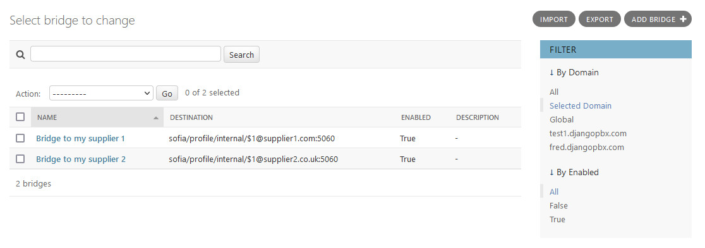

Bridges
=========

Bridges are used to send calls directly to other hosts like  a carrier or foreignr PBX. Bridges are added to destination select list.

* Click the +Add icon or Add+ button to add a record
* Click on the name in the list to edit a record
* check the box on one or more record and select the delete action to remove records

Bridge Examples
-----------------

**To another SIP server or PBX**

::

 sofia/internal/$1@xxx.xxx.xxx.xxx:5060

**To a user**

::

 user/201
 or
 sofia_contact(*/201@example.djangopbx.com)

**Bridge advanced options**

* Multiple destinations are permitted, just separate the destination with a  ,  |  or  :_:

::

 Comma , connects simultaneously
 Pipe |  connects in a sequence
 colon under score colon  :_: uses Enterprise (separate thread per destination)

**Loopback to an external number**

::

 loopback/0987654321
 
**Loopback to multiple external numbers simultaneously**

::

 loopback/012342223333,loopback/012342224444,loopback/012342225555
