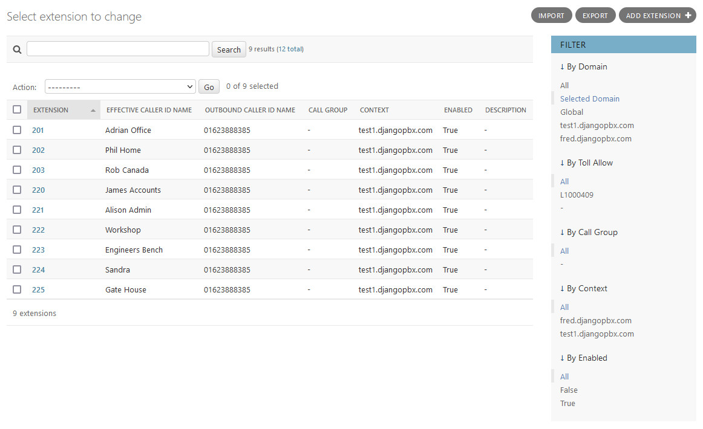
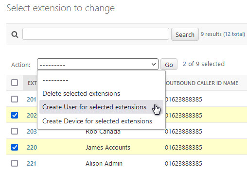
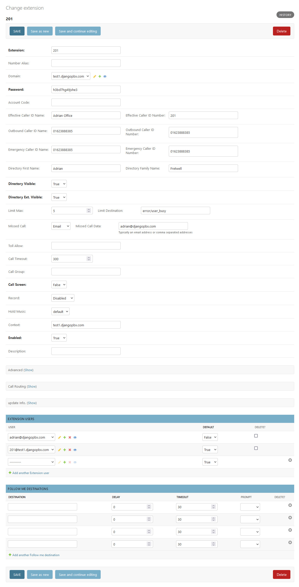
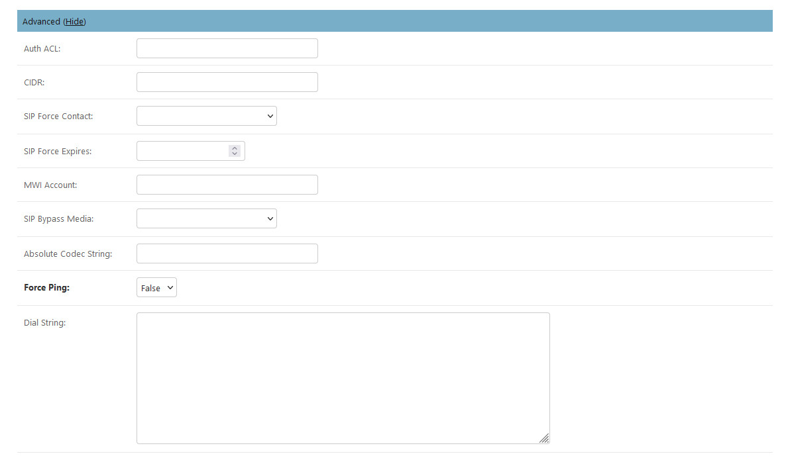
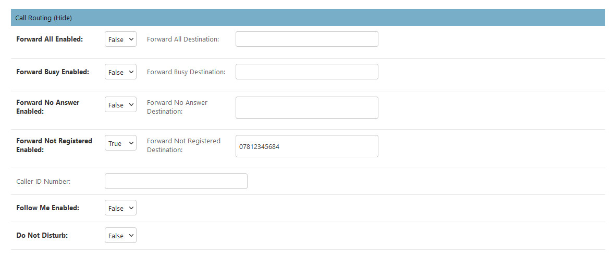

Extensions
============

**Extensions** represent endpoints such as desk phones,
soft phones or analogue adapters.  The extension becomes the SIP username
and the domain becomes the realm that determines which tenant the endpoint
is registering with.

**Extensions** have some additional **Admin Actions** that can be
performed on selected records, the screenshot below shows these.

Actions
---------

*  Delete selected extensions
    Self-explanatory.
*  Create User for selected extensions
    A user will be created with the name <extension>@<domain>.  It will be assigned the same password as the extension and also assigned to the extension as the default user.
*  Create Device for selected extensions
    Will create a device with the extension set as Line 1.  The device will have a dummy MAC address.  If a user is assigned to the extension then the user will also be assigned to the device created from the extension record.

The Edit Screen
-----------------

The **Extension** edit screen, *Change extension*, has several sections: the main window and
two collapsible sections, **Call Routing** and **Advanced**.

The Main Window
-----------------

*  Extension
    An alphanumeric value. The default configuration allows between 2 and 7 digits.
*  Number Alias
    If the extension is numeric then number alias is optional. This allows you to provide a number for the extension.
* Domain
    The domain or tenancy to which the extension belongs.  If left blank the editing user's domain will be assigned.
* Password
    This will be used as the Secret in SIP authentication.
*  Account Code
    Used for call billing purposes.  If you don't use a billing system then it's safe to leave blank.
*  Effective Caller ID Name
    Internal Caller ID name, like Fred or Sales.
*  Effective Caller ID Number
    Internal caller ID number, usually the same as the extension number.
*  Outbound Caller ID Name
    Used by the outbound route for external calls. In many countries this has to be numeric.
*  Outbound Caller ID Number
    Used by the outbound route for external calls. Business or Organisation number is often used here.
*  Emergency Caller ID Name
    This is used when making a call to an emergency service like 999.
*  Emergency Caller ID Number
    This is used when making a call to an emergency service like 999.
*  Directory First Name
    The first name used for the directory (\*411).
*  Directory Family Name
    The surname used for the directory (\*411).
*  Directory Visible
    Select whether to show the name in the directory.
*  Directory Extension Visible
    Select whether to announce the extension when calling the directory.
*  Limit Max
    Set maximum number of outgoing calls for this extension.
*  Limit Destination
    Set the destination to send the calls when the limit is exceeded.
*  Missed Call
    Set to Email and enter an email address into Missed Call Data.  A notification will be sent if the call was not answered by the extension.
*  Toll Allow
    A string of any value you choose. It is tested in the outbound route (Examples: home, business, shop, etc.).
*  Call Timeout
    How long the call can ring out.
*  Call Group
    A string of any value you choose (Examples: sales, admin, service). This is used to call a group, like a ring group; it is also used for group intercept.
*  Call Screen
    If set, this will ask the caller to identify themselves. The response is recorded and played back to the person receiving the call.
*  Record
    Enable call recording, the choices are local, inbound, outbound, or all calls.
*  Hold Music
    Choose the music or tones for music on hold on this extension.
*  Context
    The context is set by default to match the domain name. It will be automatically populated if left blank.
*  Enabled
    Set extension enabled or disabled.
*  Description
    Use for a description or notes.

Advanced Settings
-------------------

The *Advanced settings* should be left as default in most cases.  They provide the ability for fine tuning.

*  Auth ACL
    Extra authentication auth acl cases.
*  CIDR
    CIDR if needed.
*  SIP Force Contact
    Rewrite the contact port, or rewrite both the contact IP and port.
*  SIP Force Expires
    Help prevent stale registrations.  SIP Force Expires can override the client expire.
*  MWI Account
    Monitor different MWI Account identified with user@domain.
*  SIP Bypass Media
    Send media streams point to point or in transparent proxy mode.
*  Absolute Codec String
    Specify the only Codecs for the extension.
*  Force ping
    Use OPTIONS to detect if extension is reachable.
*  Dial String
    Additional variables and the location of the endpoint.

Call Routing
--------------

The *Call Routing* section allows the extension user to choose how the call is routed in various circumstances.

The choices and fields in the above screenshot require no explanation.
