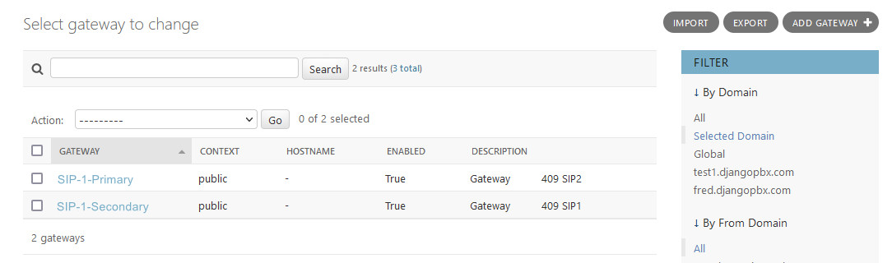
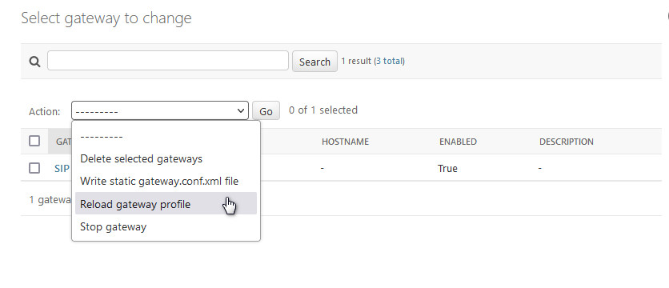
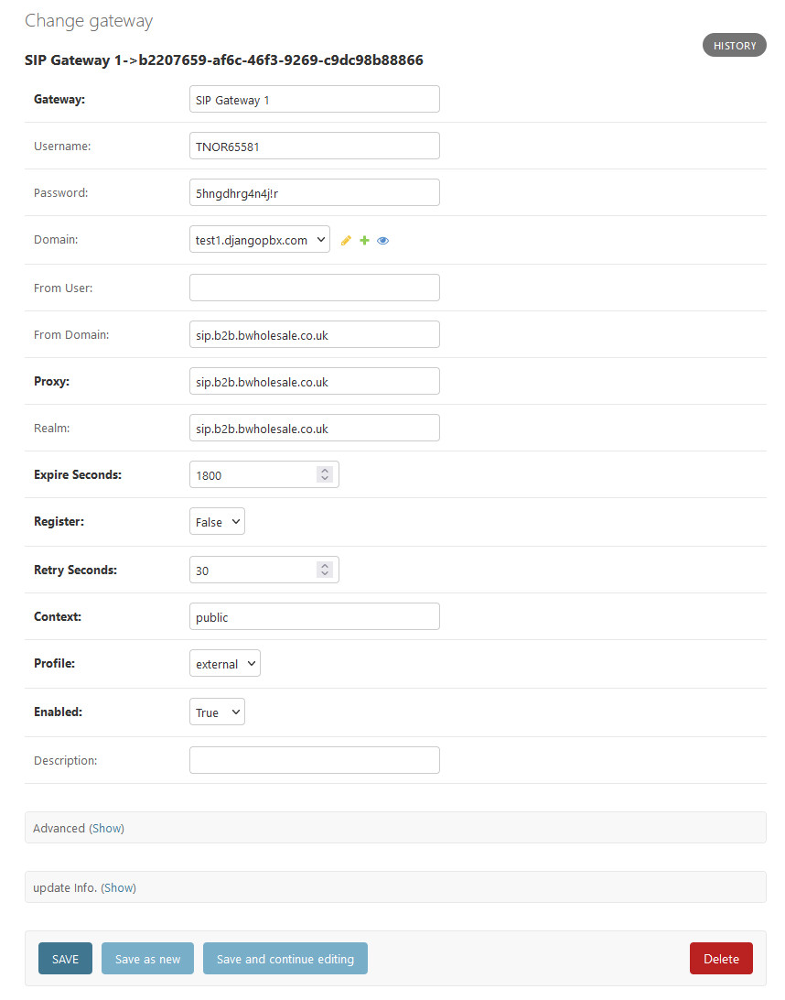
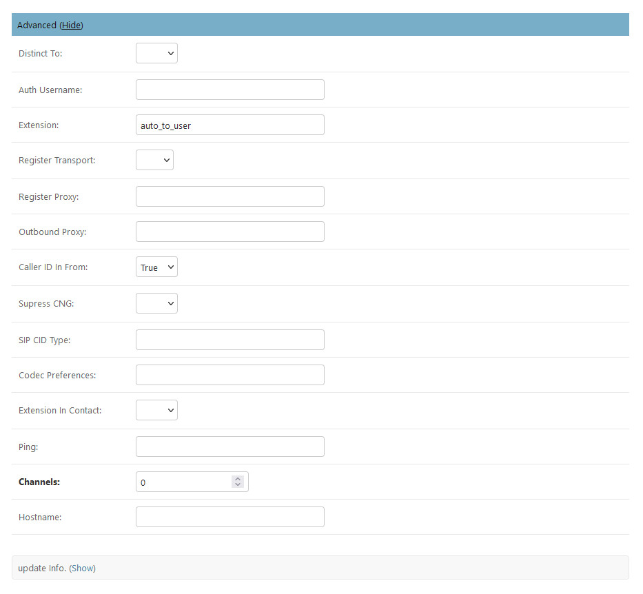

**********
Gateways
**********

*Gateways* provide access into other SIP networks. These can be Internet
Telephony Service Providers or other services that may or may not
require SIP registration.

**Gateways** have some additional *Admin Actions* that can be
performed on selected records, the screenshot below shows these.

Actions
~~~~~~~~~

*  Write static gateway.conf.xml file
    This will write out a static gateway configuration to the filing system.  This is rarely used and only required for installations that are configured for static configuration.
*  Reload gateway profile
    This will reload the sofia profile(s) associated with the selected gateways.
*  Stop gateway
    This will stop the selected gateways and mark them disabled.

The Edit Screen
~~~~~~~~~~~~~~~~~

The **Gateway** edit screen has two sections, the main window and
a collapsible *Advanced* section.

The Main Window
~~~~~~~~~~~~~~~~~

* Gateway
    The name of the Gateway. This can be anything you like, a VoIP provider, an account, or service.
* Username
    This is the username for SIP registration provided by the service operator.
* Password
    This is the password for SIP registrations it is provided by the service operator.
* Domain
    The domain or tenancy to which the gateway belongs.  If left blank the editing users domain will be assigned.
* From User
    Optional, sets a specific SIP From User.
* From Domain
    Optional, sets a specific SIP From Domain.
* Proxy
    Required, sets the  server address specified by the service provider.
* Realm
    Optional, but is may be required by some services providers.
* Expire Seconds
    Optional, sets the expiry time for the registration.
* Register
    Required, set to **true** if the carrier uses a username and password.  Set to **false** if the carrier uses IP authentication.
* Retry Seconds
    Optional, sets the failed registration re-try interval.
* Context
    Required, by default is set to public and this is usually the correct value.
* Profile
    Required, sets the SIP profile used by the gateway, defaults to external.
* Enabled
    Required, sets the gateway to be enabled or disabled.
*  Description
    Use for a description or notes.

Advanced Settings
~~~~~~~~~~~~~~~~~~~

The *Advanced settings* should be left as default in most cases.  They provide the ability adjust some values.

* Distinct To
    Not currently used
* Auth Username
    Authorisation username if different to Username
* Extension
    Used for testing but generally should be set to **auto_to_user**.
* Register Transport
    Specifies the transport - use SIP with TCP, UDP or TLS.
* Register Proxy
    Hostname or IP address of the register proxy. host[:port].
* Outbound Proxy
    Hostname or IP address of the outbound proxy. host[:port].
* Caller ID In From
    If your caller ID isn't working setting this to true will often fix the problem.
* Supress CNG
    If True comfort noise will be diabled.
* Sip CID Type
    The SIP caller id type: pid, rpid, or none.
* Codec Preferences
    Set codec preferences as a list. Ex: PCMA,G729,G722
* Extension In Contact
    Option to set the Extension in Contact header.
* Ping
    If your server is behind NAT then the ping option can be used to maintain a NAT hole through the firewall. The ping interval is in seconds.
* Hostname
    This should usually be left empty. When the hostname is set the gateway will only start on the matching server with same hostname. If the hostname is left blank the gateway will start regardless of the server's hostname.
