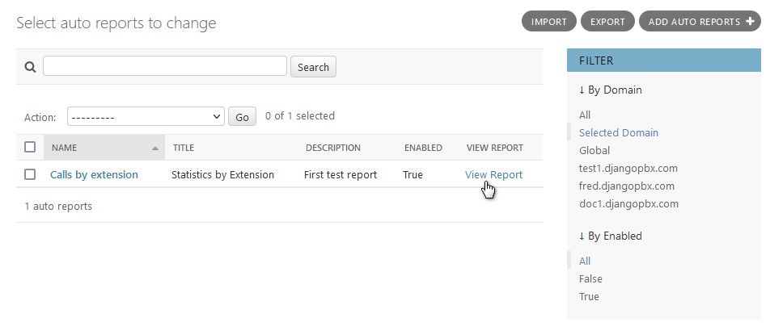
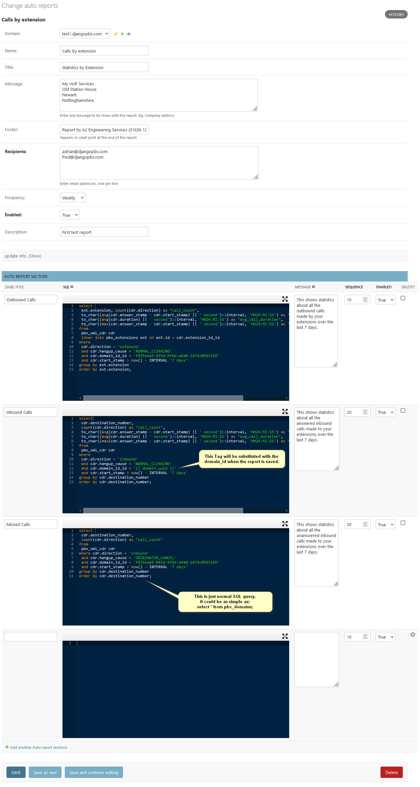
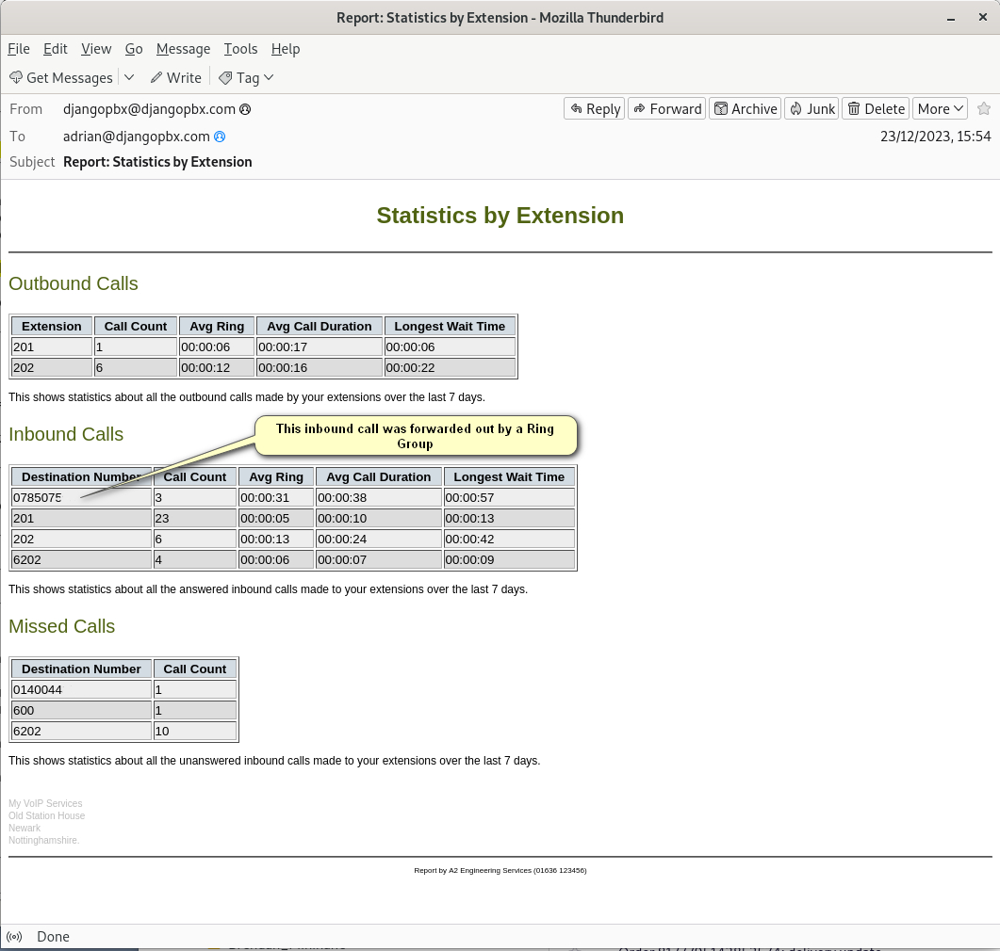

An Example report
===================

The **Auto Reports** listing shows all the available reports for a given domain; here
there is an option to edit or view the report.

When **View Report** is clicked the system will generate the report in real time and
display the results.  This can be helpful when prototyping new reports.  This screen
will also let you know if there were any errors in generating the report.

The Edit Screen
~~~~~~~~~~~~~~~~~

The **Auto Reports** edit screen, *Change auto reports*, has several sections: the main window and
a collapsible section for update info details.

There is also an **Auto Report Section** section that allows any number of
report sections to be added.  Each report section has its own SQL query.

It may be helpful to refer to the :doc:`../../architecture/db_entity_relationship_diagram`
or the :doc:`../../architecture/db_schema` documents when constructing
your SQL query.

The Report Email
~~~~~~~~~~~~~~~~~~

This is an actual email generated and sent out from the example report above.
The email client showing the message is Thunderbird.

