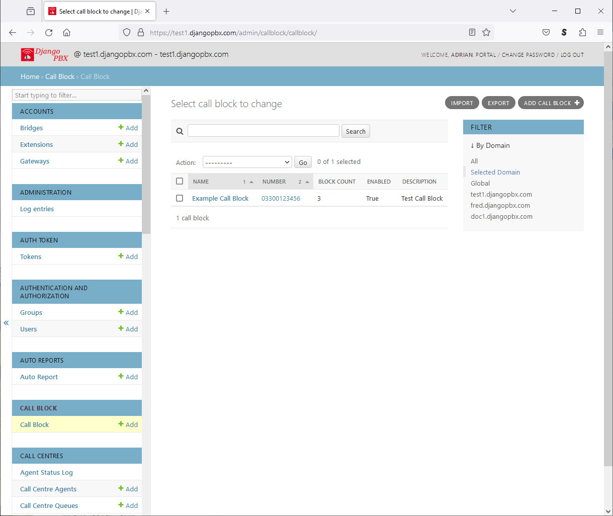
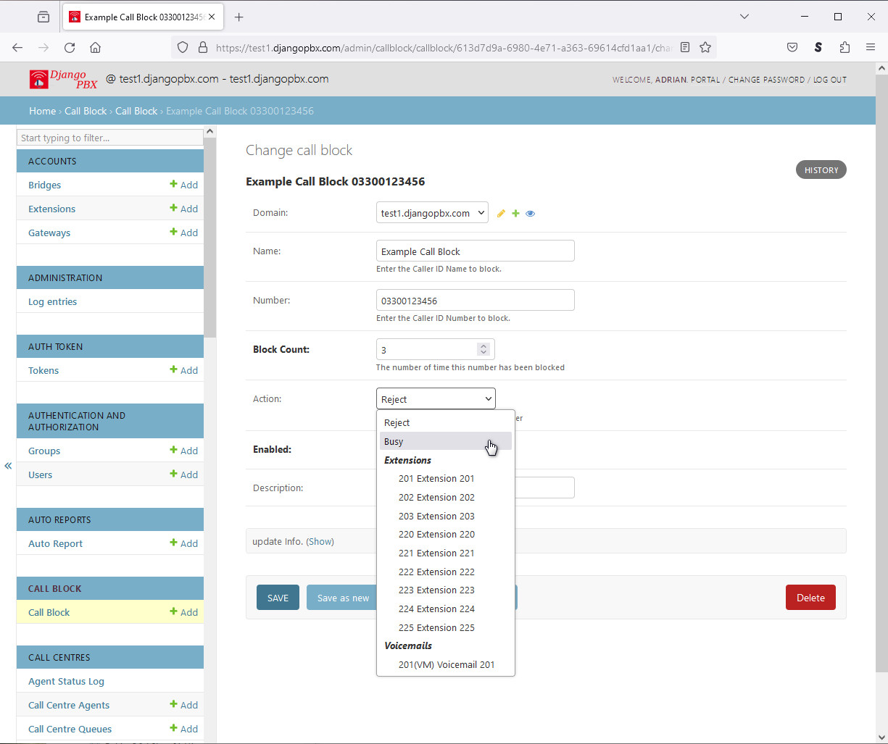

************
Call Block
************

The **Call Block** application allows inbound calls to be filtered or rejected
based on their *Caller ID Number* or *Caller ID Name*

There are a choice of **actions**, for example, a call could be sent to a Voicemail, rejected or given a busy signal.

Call Block Listing
====================

Call Block Edit Screen
========================

