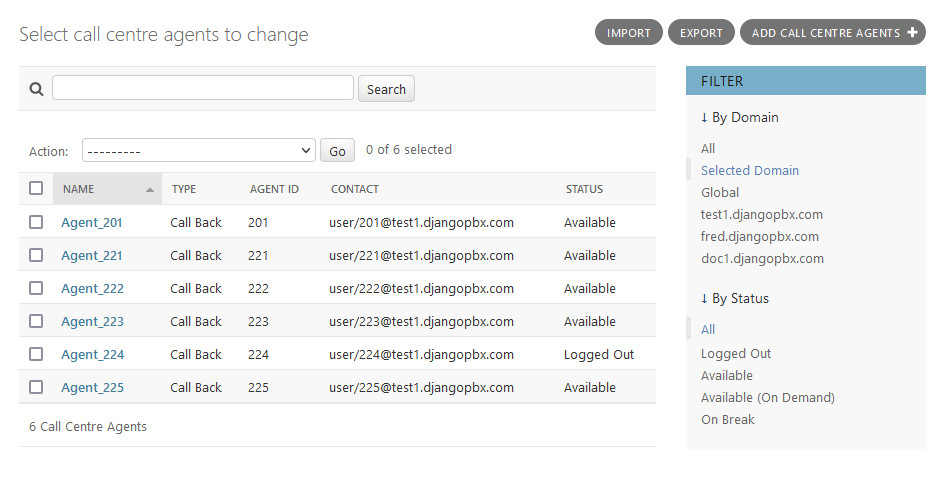
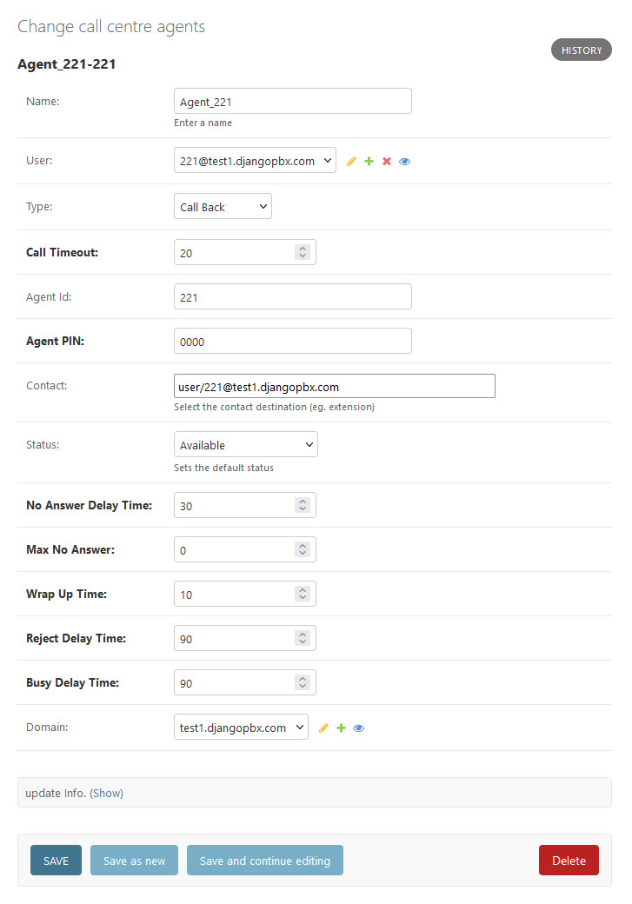

Agents
========

**Agents** are the members or people who will take calls distributed to then by the
Call Centre Queues.

The Edit Screen
-----------------

The **Agent** edit screen, *Change call centre agents*, shows the setting for an Agent.
Agents have Status and States. The Status is the general state of the agent
set by Logging In or Logging Out, whilst States are dynamic and are updated by the system
based on the progress of an agent in a call.

Agent Options
---------------

*  Agent Name
    Name of the Agent. When adding Agents to a Queue, this is what describes the Agent.
*  User
    Associates a system user with the call centre Agent
*  Type
    Two types are supported, **Callback** and **UUID Standby**. Callback will try to reach the Agent via the contact fields value. UUID Standby will try to directly bridge the call using the Agent UUID.
*  Call Timeout
    Length of time to ring the Agent before deeming them unavailable.
*  Agent Id
    An ID that can be used to log the Agent in and out of the Call Centre.
*  Agent PIN
    PIN to log the Agent into the call center.  Not required if agent_authorized=true is set in the dialplan for \*22.
*  Contact
    A List/Edit to select which extension should be used to contact the Agent.
*  Status
    Sets the default status for the Agent in the Call Centre
*  No Answer Delay Time
    The time the system will wait to attempt a call to the Agent again if they did not answer within the **Call Timeout** time.
*  Max No Answer
    Max number of attempts to call the Agent. For example, when set to 1, if the agent does not answer within the first **Call Timeout**, they will not get another chance to answer the call. If set to 2, the Agent will have two attempts to answer the call.
*  Wrap Up Time
    The amount of time after a ending call before the Agent will be rung again.
*  Reject Delay Time
    If an Agent rejects a call manually then this is the time to wait before a call is offered again.
*  Busy Delay Time
    If the Agent is on **Do Not Disturb**, the time to wait before trying them again.

