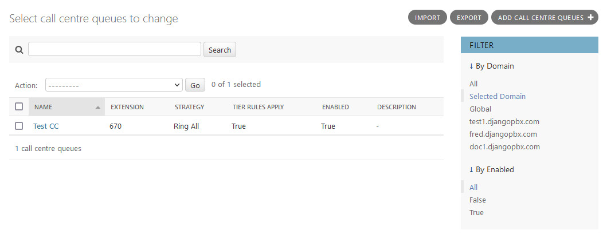
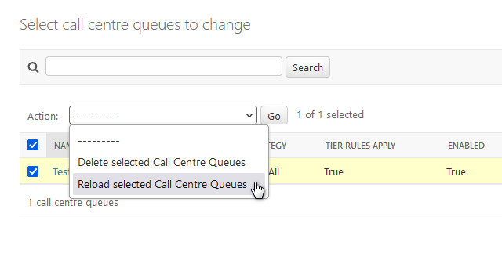
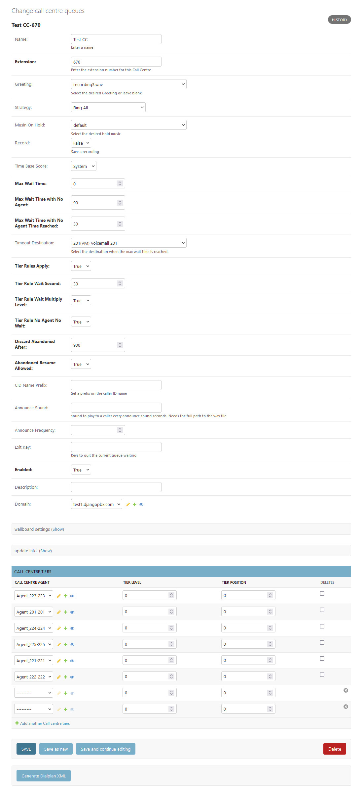

Queues
========

**Queues** are the fundamental part of a Call Centre, they control how calls are
handled, and by whom.  The **Queue** also contains some display settings for Wallboard
use.

**Queues** have some additional **Admin Actions** that can be
performed on selected records, the screenshot below shows two.

Actions
~~~~~~~~~

*  Delete selected Call Centre Queues
*  Reload selected Call Centre Queues

The Edit Screen
~~~~~~~~~~~~~~~~~

The **Queue** edit screen, *Change call centre queues*, has several sections: the main window and
a collapsible section for **Wallboard** Settings

There is also a **Call Centre Tiers** section that allows Agents to be
assigned to the **Queue** with Tier levels and positions.

Queue Options
~~~~~~~~~~~~~~~~

* Name
    The Queue name.

* Extension
    The number to call to join the Queue.

* Greeting
    A recording to play when joining the Queue, it can be left blank.

* Strategy
    The strategy defines how calls are distributed in a Queue. A table of different strategies can be found below.

    * **Ring All:** Rings all Agents simultaneously.
    * **Longest Idle Agent:** Rings the Agent who has been idle the longest, taking into account the Tier level.
    * **Round Robin:** Rings the Agent in position but remember last tried Agent.
    * **Top Down:** Rings the Agent in order position starting from 1 for every member.
    * **Agent with Least Talk Time:** Rings the Agent who has spent the least time in a call.
    * **Agent with Fewest Calls:** Rings the Agent who has handled the fewest calls.
    * **Sequentially by Agent Order:** Rings Agents sequentially by Tier and order.
    * **Random:** Rings Agents in random order.
    * **Ring Progressively:** Rings Agents in the same way as top-down, but keeping the previous Agents ringing (it will end up as ring-all).

* Music On Hold
    The system will playback whatever you specify to incoming callers.

* Record
    If set to **True** the Queue will be recorded.

* Time Base Score
    This can be either **queue** or **system**. If set to **system**, it will add the number of seconds since
    the call was originally answered (or entered the system) to the caller's base score.
    Raising the caller's score allows them to receive priority over other calls that might have been
    in the Queue longer but not in the system as long. 
    If set to **queue**, you get the default behavior, ie nobody's score gets increased upon entering
    the Queue (regardless of the total length of their call).

* Max Wait Time
    Defaults to 0 to be disabled. Any value is in seconds, and will define the delay before we quit the callcentre
    application if the member hasn't been answered by an Agent. Can be used for sending call to voicemail if wait time is too long.

* Max Wait Time With No Agent
    Defaults to 90 to be disabled. The value is in seconds, and it will define the amount of time the Queue has to be
    empty (without logged Agents, on a call or not) before we disconnect all members. This principle protects kicking all
    members waiting if all Agents are **Logged Out** by accident.

* Max Wait Time With No Agent Time Reached
    Defaults to 30. This will define the length of time in seconds after the **Max Wait Time With No Agent** is reached
    to reject a new caller.

* Timeout Destination
    Where to send the call if it is kicked out of the call centre.

* Tier Rules Apply
    This defines if we should apply the following Tier rules when a caller advances 
    through a Queue's tiers. If set to **False**, they will use all Tiers with no wait.

* Tier Rule Wait Second
    The time in seconds that a caller is required to wait before advancing to the next Tier.
    This will be multiplied by the Tier level if **Tier Rule Wait Multiply Level** is set to True.
    If **Tier Rule Wait Multiply Level** is set to false, then after **Tier Rule Wait Second**'s have passed,
    all Tiers are open for calls in the Tier Order and no advancement (in terms of waiting) to another Tier is made.

* Tier Rule Wait Multiply Level
    If set to **False**, then once **Tier Rule Wait Second** is passed, the caller is offered to all Tiers in order (level/position).
    If set to **True**, the **Tier Rule Wait Second** will be multiplied by the Tier level and the caller will have to wait on
    every Tier's **Tier Rule Wait Second** before advancing to the next Tier.

* Tier Rule No Agent No Wait
    If set to **True**, callers will skip Tiers that don't have Agents available. Otherwise, they are required to wait
    before advancing. Agents must be **Logged Out** to be considered not available.

* Discard Abandoned After
    The number of seconds before we completely remove an abandoned member from the queue. When used in conjunction
    with **Abandoned Resume Allowed**, callers can come back into a queue and resume their previous position.

* Abandoned Resume Allowed
    If set to **True**, a caller who has abandoned the queue can re-enter and resume their previous position in that queue.
    In order to maintain their position in the queue, they must not abandoned it for longer than the number
    of seconds defined in **Discard Abandoned After**.

* CID Name Prefix
    Set a prefix on the caller ID name.

* Announce Sound
    A sound to play to a caller every Announce Frequency (in seconds).  Needs the full path to the .wav file.

* Announce Frequency
    How often the Announce Sound is played in seconds.

* Exit Key
    Keys to quit the current Queue waiting.

* Description
    Enter a description as a note or to define what the Queue is for.

* Wallboard Settings
    A collapsed section, these settings control how the Queue will display on the Wallboard.

    * **Name:** The name of the Queue, this is displayed next to the clock on the Wallboard.
    * **Description:** This is for any notes about the Queue and is not displayed on the Wallboard.
    * **Waiting Warning Level:** The number of calls waiting before the waiting card turns from green to amber.
    * **Waiting Critical Level:** The number of calls waiting before the waiting card turns from amber to red.
    * **Abandoned Warning Level:** The number of calls lost before the abandoned card turns from green to amber.
    * **Abandoned Critical Level:** The number of calls lost before the abandoned card turns from amber to red.
    * **Show Agents:** Set to True to show the Agents on the Wallboard
    * **Number of Agents per row:** How many Agents to show per row.

    All the Wallboard colours are controllable via the pbx.css stylesheet.

* Call Centre Tiers
    This section allows Agents to be assigned to the Queue with Tier levels and positions.
