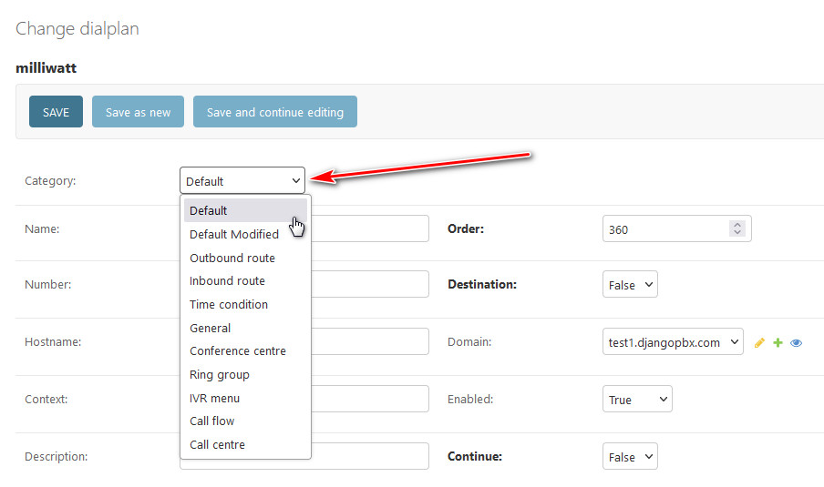

Dialplan Categories
=====================

**Dialplan Categories** help to organise and manage dialplans.

These categories are generated from the installed applications.  If an application
creates or maintains any form of dialplan then it should provide its own category.

The category is defined in the :file:`apps.py` file of the application.
Below is the apps.py file for the *Ring groups* application:

.. code-block:: python

    class RinggroupsConfig(AppConfig):
        default_auto_field = 'django.db.models.BigAutoField'
        name = 'ringgroups'
        verbose_name = _('Ring Groups')
        pbx_uuid = '77578687-8eb7-4bb7-a00a-ddf3e8b7169f'
        pbx_category = 'Switch'
        pbx_subcategory = ''
        pbx_version = '1.0'
        pbx_license = 'MIT License'
        pbx_dialplan = True
        pbx_dialplan_category = 'Ring group'

As you can see **pbx_dialplan** is set to True, this indicates that *Ring Groups* do
create or maintain dialplans.

**pbx_dialplan_category** defines the category.

Special Categories
--------------------

There are two special categories **Default** and **Default Modified**.

- **Default** 
    Indicates that the dialplan is one of the default ones installed
    when the domain was created.
    Any modifications to a **Default** dialplan will be lost if the management command
    **dialplandefaults** is run for this domain.
- **Default Modified** 
    This is a way of flagging that this is a Default dialplan but it must
    not be overwritten when restoring defaults.

