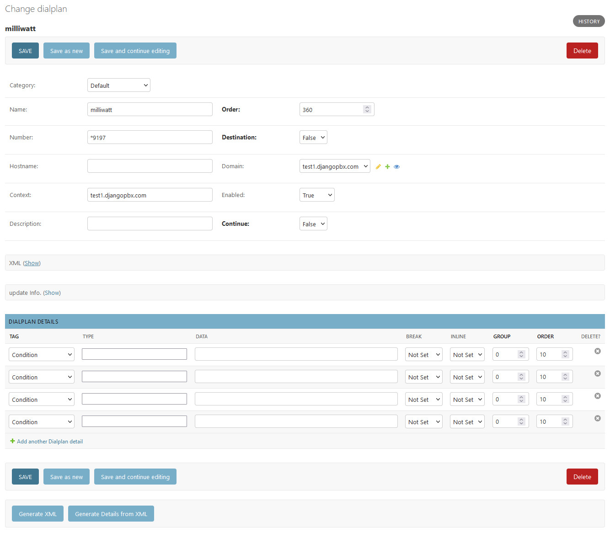

Dialplan Editing
==================

**Dialplan** editing is largely the same as editing any other record within the Admin Interface.
The main difference is the extra buttons available at the bottom of the **Dialplan** edit form.
These buttons are labelled **Generate XML** and **Generate Details from XML**.

Both **Generate XML** and **Generate Details from XML** are associated with the **Dialplan Details**
section towards the bottom of the **Dialplan** edit form.

There is a :doc:`/admin/tenants/default_settings` called "dialplan_details".  By default this is set to **false**.  What
this means is that when the default set of dialplans are loaded, detail records are not created;
the assumption is that most superusers are capable of editing the XML directly.

We will look at this in more detail in the following section where we will look at the default **milliwatt**
dialplan in detail.

