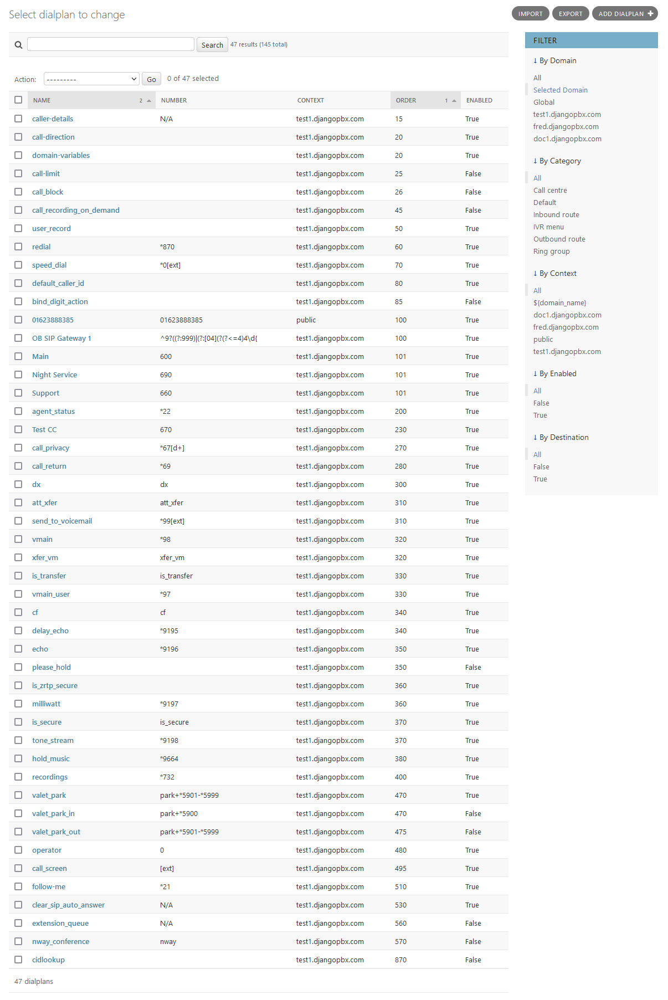

Dialplan Listing
==================

The **Dialplans** are listed in an ascending order of sequence.  It is this order
in which they are processed when routing a call.

You will see from the screenshot below that various listing filters are available.
The **By Category** filter can be very helpful in finding various dialplans.

It is also worth mentioning that the default domain filter is set at **Selected Domain**.
This shows all the dialplans that belong to the domain you are in.  If you need to look at
**global** or **public** dialplans then choose the **Global** option in the **By Domain** filter.

