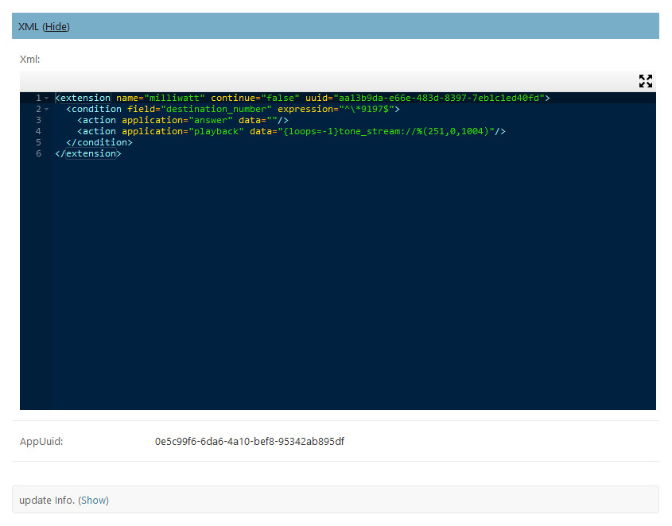
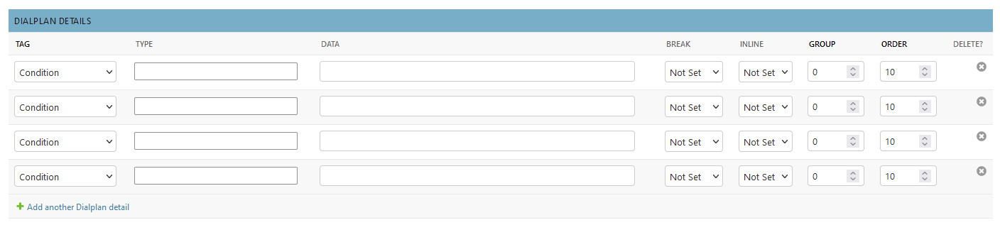
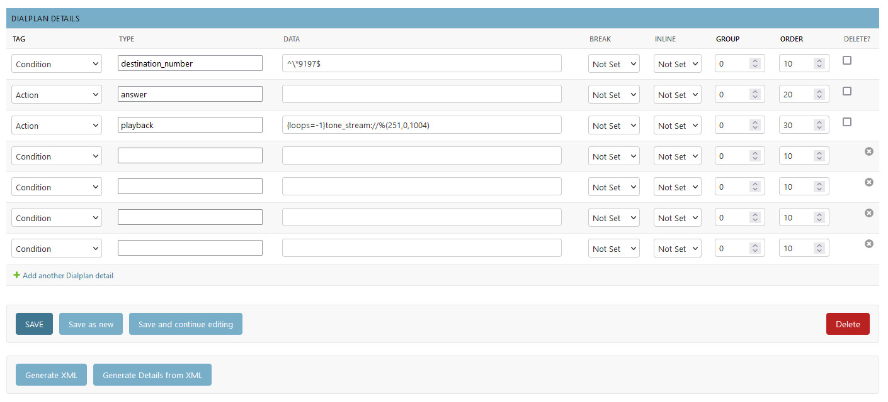

The Milliwatt Dialplan
=======================

I have chosen to look in more detail at the **milliwatt dialplan** because it is one of the
most simple dialplans you will encounter.

So what does the **milliwatt dialplan** do?  

1. It defines an extension number \*9197.
2. It answers the call.
3. It plays a tone stream.

The tone stream is defined by the three sets of numbers: 251,0,1004.  These mean it will play
a 1004Hz tone for a duration of 251ms with 0ms of intervening silence, continuously (loops=-1).

Let's look at the XML:

The XML is six lines of code.  First it defines the **extension**, then a **condition**.  In
this case the condition is destination_number and it represents the number we dial
to listen to the tone stream (\*9197).

Then we have the two actions, **answer** and **playback**.

You will notice that the **Dialplan Details** section just shows empty records:

This is because by default we do not create the dialplan details, they are not required to run the system,
they are just there to help wnen constucting or editing a dialplan.

The **Tag** and **Type** fields act as an aide mémoire to help you to remember what options are available.
If the **Dialplan Details** are empty but there is XML in the XML edit box, then you can use the
**Generate Details from XML** button to perform a sort of *reverse engineer* on the XML to populate
the **Dialplan Details**.

The screenshot below shows the **Dialplan Details** populated after clicking the button.
Note that the system always provides four extra blank records for you to use if required.

If you use the **Dialplan Details** section to help constuct your dialplan then remember that the XML box
in the dialplan record WILL NOT get updated until you click on the **Generate XML** button.

