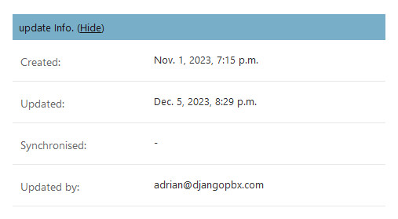
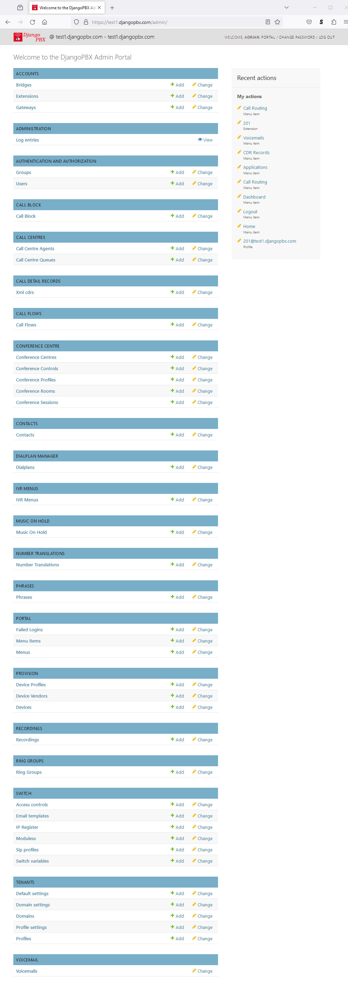
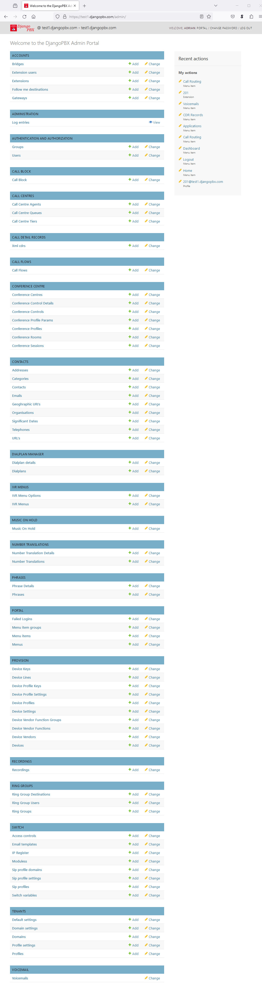

Admin Overview
================

The **Admin Interface** is the place where all the superuser
configuration tasks are undertaken.  This is often just a simple
case of creating, editing or deleting database records.

All records shown in the **Admin Interface** have a collapsible
update section where details about the record's recent history
can be found.  See the image below:

Below are two screenshots of the **Admin Interface**.
The first shows the default set of models that will
generally be used in production.

The second screenshot shows the full set of models; this can be useful
for editing, importing, or exporting a related child table
directly.  This view can be enabled in the settings module
by setting::

    PBX_ADMIN_SHOW_ALL = True.

The default model list:

The full model list:

