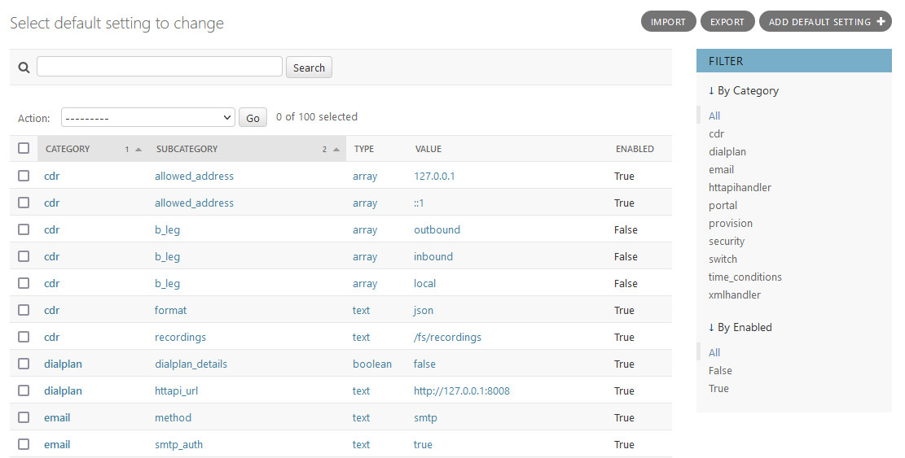
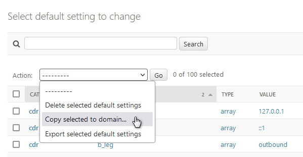
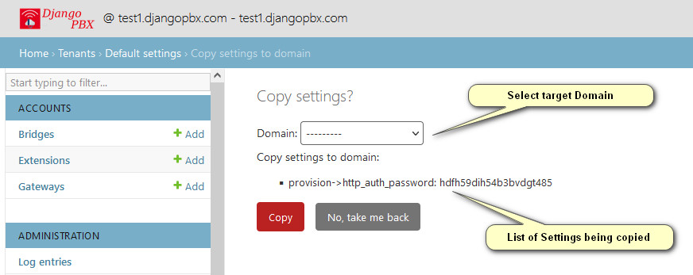
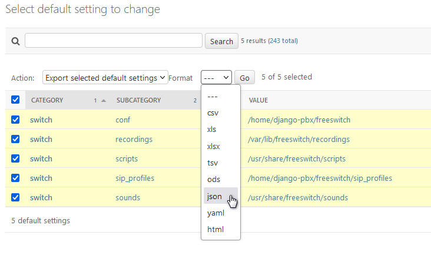
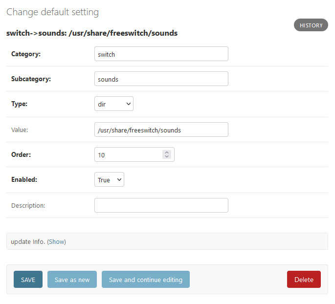

Default Settings
==================

**Default Settings** are simply an extensible list of values that can be
used to control how various aspects of DjangoPBX system operate.

A setting is defined by a **Category** name and a **Sub Category** name, the
**Value** field holds the data for the setting.
There is also a **Type** field that describes how we should interpret the **Value**
because all the **Values** are stored as text in a database.

Default Setting Listing
-------------------------

Actions
---------

The following **actions** are available on the listing screen:

*  Delete selected default settings
    Self-explanatory.
*  Copy selected to domain
    This presents an intermediate screen (shown first below) that allows the selection of the target domain.
    The purpose of this is to make it easy to create **Domain Settings** that override **Default Settings**.
*  Export selected default settings
    This presents an intermediate screen (shown second below) that allows the export format to be chosen.

Copy selected to domain
^^^^^^^^^^^^^^^^^^^^^^^^^

Export selected default settings
^^^^^^^^^^^^^^^^^^^^^^^^^^^^^^^^^^

Default Settings Edit Screen
------------------------------

Setting Options
-----------------

*  Category
    Name used to identify a group of settings.
*  Subcategory
    Name used to identify an individual setting within a Category.
*  Type
    Specifies the data type of the value, it can be one of:
        * text
        * numeric
        * array
        * boolean
        * code
        * uuid
        * name
        * var
        * dir
*  Value
    The actual data for the setting.
*  Order
    Only requied for the **array** type to specify the order of the array.
*  Enabled
    Sets the value active or inactive.
*  Description
    A note to help describe what the setting is used for.

We have not shown the edit screens for both **Domain Settings** and **Profile Settings** because
they are very similar to the **Default Settings** screens, just having the addition of a **Domain**
select box and a **Profile** select box respectively.

