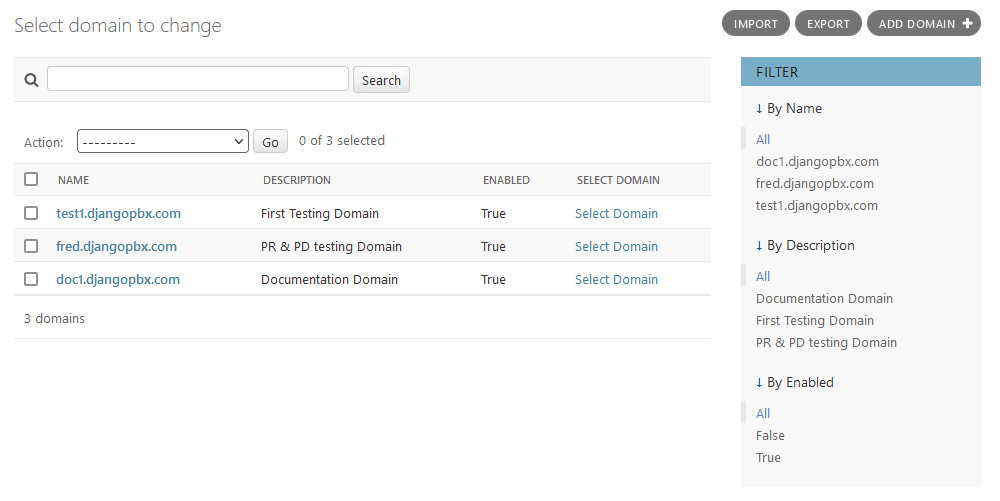
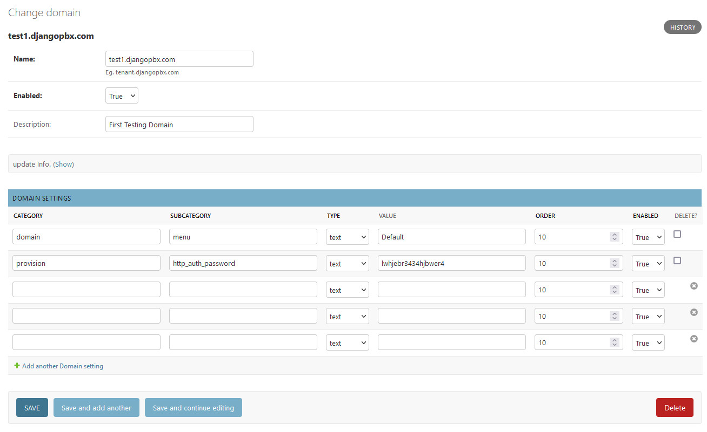

Domains
==========

The **Domain** can be regarded as the foundation stone of the DjangoPBX system.
Most of the other database tables reference the **Domains** table.

A **Domain** defines a customer or tenant based on their *Caller ID Number* or *Caller ID Name*

There are a choice of **actions**, for example, a call could be sent to a Voicemail, rejected or given a busy signal.

Domain Listing
----------------

Domain Edit Screen
--------------------

Here we can see that this Domain has two **Domain settings**,  **Menu** and **http_auth_password**.
We will cover Settings in a later section.

