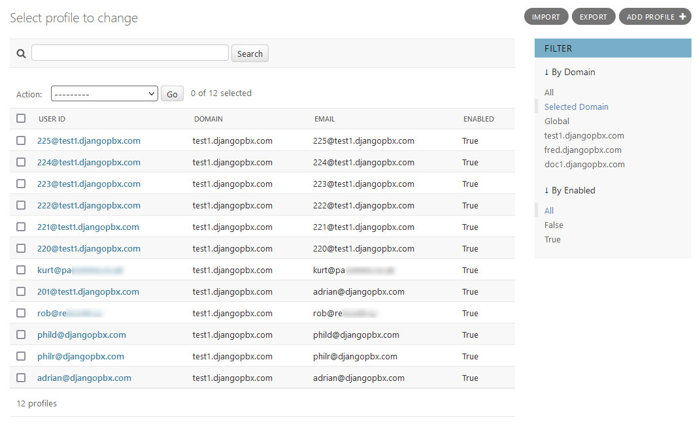
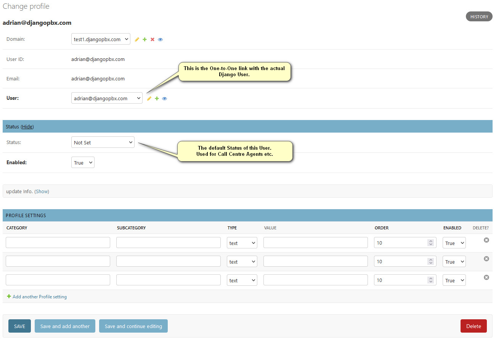

Profiles
==========

The **Profile** extends the Django User information.  It is in actual fact
a database table with a one-to-one relationship with the Django auth_user table.

The purpose of the **Profile** is to augment the auth_user data with PBX-specific
items such as the relationship to a **Domain** and to link with any specific settings
applied at the **Profile** level.

Profile Listing
-----------------

Profile Edit Screen
---------------------

Here we can see that this **Profile** does not have any **Profile settings**.

