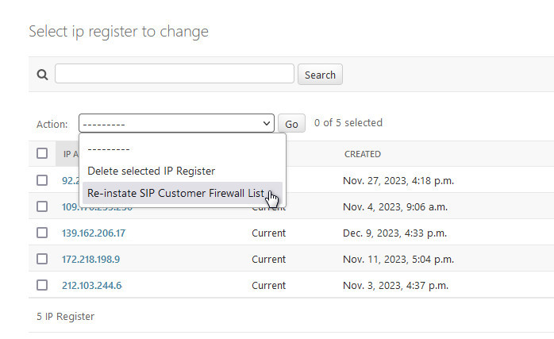

**********
Firewall
**********

The firewall configuration uses `nftables <https://nftables.org/projects/nftables/index.html>`_.
This is a standard package provided by the Debian OS distribution.  
A basic description of its operation is given further down this page, and the configuration
file provided by the install script is shown at the end of this document.

The configuration script is located at /etc/nftables.conf

The nftables.conf file has a "defines" section at the top where you can specify some of the IP addresses
that you would like to be present in the firewall settings when the machine is restarted or
the firewall rules are reloaded.  These defines are for populating the following lists:

*  IPv4 SIP Gateways
    Contains the IPv4 addresses of your service providers.
*  IPv6 SIP Gateways
    Contains the IPv6 addresses of your service providers.
*  IPv4 SIP Customers
    Contains the IPv4 addresses of your customers (automatically populated when phones successfully register).
*  IPv6 SIP Customers
    Contains the IPv6 addresses of your customers (automatically populated when phones successfully register).
*  IPv4 White List
    IPv4 addresses of trusted servers or people.  Typical addresses that will connect via ssh.
*  IPv6 White List
    IPv6 addresses of trusted servers or people.  Typical addresses that will connect via ssh.
*  SIP Service Ports
    The ports on which you offer public SIP services.
*  Private TCP Services
    The ports on which you offer private TCP services, for example 22 for ssh or 5666 for Nagios.
*  Public TCP Services
    The ports on which you offer public TCP services, like 443 for web portal access.
*  Private UDP Services
    Not commonly required.
*  Public UDP Services
    Not commonly required.

The firewall consists of several tables:
*  inet filter
*  inet mangle
*  netdev filter

The inet filter table is where most of the work is done.
This table has two filter chains inbound_ipv4 and inbound_ipv6, and an outbound
chain where QOS (dscp) flags are set.
This table contains the lists that correspond with the defines specified above, and also
contains a set of counters for firewall statistics.

The inet mangle table contains the prerouting chain which is used to detect bad and
malformed TCP packets.

The netdev filter is where we implement the block lists and detect
IPv4 addresses that should not be arriving on an internet facing
interface (RFC 1918, RFC 5735 etc.).

Operation
-----------
SIP traffic is limited by the firewall to 20 packets per source IP per hour unless the IP is in the SIP Customer List.
Once a phone from an IP successfully registers the IP is automatically added to the SIP Customer List, thus lifting the restriction.
If a customer has a fixed IP, then that can simply be added to the firewall manually, not waiting to have a successful register add it.

The web portal works the other way around, full access is permitted, but too many failed login attempts will result
in the source IP being put in a block list.

Reloading nftables will lose the contents of the lists.  You can of course save the rules with nft list ruleset > my_firewall_rules.
Following a nftables reload there is an action in Admin->Switch->IP Register to reinstate the SIP Customer List:

The SIP Customer List can also be reinstated from the command line see: :ref:`reinstatefwsipcustomerlist`.

Configuration nftables.conf
-----------------------------

::

  #!/usr/sbin/nft -f

  flush ruleset

  define ipv4_sip_gateways = { 192.168.13.5, 192.168.88.0/24 }
  define ipv6_sip_gateways = { fc00:6b2:0211:fb0f::/64 }
  define ipv4_sip_customers = {}
  define ipv6_sip_customers = {}
  define ipv4_white_list = {}
  define ipv6_white_list = { fc00:04c8:0214:fc81::/64 }
  define sip_service_ports = { 5060, 5061 }
  define private_tcp_services = { 22 }
  define public_tcp_services = { 80, 443 }
  define private_udp_services = {}
  define public_udp_services = {}

  table inet filter {
    counter sip-ipv4-inbound-gateway {
	comment "IPv4 SIP received from Gateway"
    }

    counter sip-ipv4-udp-authorised {
	comment "IPv4 UDP SIP packets authorised"
    }

    counter sip-ipv4-tcp-authorised {
	comment "IPv4 TCP SIP packets authorised"
    }

    counter sip-ipv4-udp-unauthorised {
	comment "IPv4 UDP SIP packets unauthorised"
    }

    counter sip-ipv4-tcp-unauthorised {
	comment "IPv4 TCP SIP packets unauthorised"
    }

    counter sip-ipv4-udp-dropped {
	comment "IPv4 UDP SIP packets dropped"
    }

    counter sip-ipv4-tcp-dropped {
	comment "IPv4 TCP SIP packets dropped"
    }

    counter sip-ipv6-inbound-gateway {
	comment "IPv6 SIP received from Gateway"
    }

    counter sip-ipv6-udp-authorised {
	comment "IPv6 UDP SIP packets authorised"
    }

    counter sip-ipv6-tcp-authorised {
	comment "IPv6 TCP SIP packets authorised"
    }

    counter sip-ipv6-udp-unauthorised {
	comment "IPv6 UDP SIP packets unauthorised"
    }

    counter sip-ipv6-tcp-unauthorised {
	comment "IPv6 TCP SIP packets unauthorised"
    }

    counter sip-ipv6-udp-dropped {
	comment "IPv6 UDP SIP packets dropped"
    }

    counter sip-ipv6-tcp-dropped {
	comment "IPv6 TCP SIP packets dropped"
    }

    counter web-ipv4-tcp-dropped {
	comment "IPv4 TCP Web packets dropped"
    }

    counter web-ipv6-tcp-dropped {
	comment "IPv6 TCP Web packets dropped"
    }

    set ipv4_white_list {
	type ipv4_addr
	flags interval
	comment "Accept packets from these IPv4 hosts"
	elements = $ipv4_white_list
    }

    set ipv6_white_list {
	type ipv6_addr
	flags interval
	comment "Accept packets from these IPv6 hosts"
	elements = $ipv6_white_list
    }

    set ipv4_sip_gateway_list {
	type ipv4_addr
	flags interval
	comment "IPv4 SIP Gateways"
	elements = $ipv4_sip_gateways
    }

    set ipv6_sip_gateway_list {
	type ipv6_addr
	flags interval
	comment "IPv6 SIP Gateways"
	elements = $ipv6_sip_gateways
    }

    set ipv4_sip_customer_list {
	type ipv4_addr
	comment "SIP Customer IPv4 Addresses"
	elements = $ipv4_sip_customers
    }

    set ipv6_sip_customer_list {
	type ipv6_addr
	comment "SIP Customer IPv6 Addresses"
	elements = $ipv6_sip_customers
    }

    set ipv4_web_block_list {
	type ipv4_addr
	comment "IPs banned from web service"
    }

    set ipv6_web_block_list {
	type ipv6_addr
	comment "IPs banned from web service"
    }

    set ipv4_sip_meter {
	type ipv4_addr
	size 65535
	flags timeout, dynamic
    }

    set ipv6_sip_meter {
	type ipv6_addr
	size 65535
	flags timeout, dynamic
    }

    set sip_service_ports {
	type inet_service
	comment "Destination ports of SIP services we offer"
	elements = $sip_service_ports
    }

    set private_tcp_services {
	type inet_service
	comment "Destination ports of whitelist TCP only services we offer"
	elements = $private_tcp_services
    }

    set public_tcp_services {
	type inet_service
	comment "Destination ports of public TCP services we offer"
	elements = $public_tcp_services
    }

    set private_udp_services {
	type inet_service
	comment "Destination ports of whitelist only UDP services we offer"
	elements = $private_udp_services
    }

    set public_udp_services {
	type inet_service
	comment "Destination ports of public UDP services we offer"
	elements = $public_udp_services
    }

    chain inbound_ipv4 {
	udp dport 16384-32768 accept
	icmp type echo-request limit rate 5/second accept
	icmp type { destination-unreachable, echo-reply, source-quench, time-exceeded } accept

	ip saddr @ipv4_sip_gateway_list counter name sip-ipv4-inbound-gateway accept

	ip saddr @ipv4_sip_customer_list udp dport @sip_service_ports counter name sip-ipv4-udp-authorised accept
	ip saddr @ipv4_sip_customer_list tcp dport @sip_service_ports counter name sip-ipv4-tcp-authorised accept
	udp dport @sip_service_ports update @ipv4_sip_meter { ip saddr timeout 2h limit rate 20/hour } counter name sip-ipv4-udp-unauthorised accept
	udp dport @sip_service_ports counter name sip-ipv4-udp-dropped drop
	tcp dport @sip_service_ports update @ipv4_sip_meter { ip saddr timeout 2h limit rate 20/hour } counter name sip-ipv4-tcp-unauthorised accept
	tcp dport @sip_service_ports counter name sip-ipv4-tcp-dropped drop

	ip saddr @ipv4_web_block_list tcp dport { 80, 443 } counter name web-ipv4-tcp-dropped drop
	# Allow traffic from established and related packets
	ct state { established, related } accept
	tcp dport @public_tcp_services accept
	udp dport @public_udp_services accept
	ip saddr @ipv4_white_list tcp dport @private_tcp_services accept
	ip saddr @ipv4_white_list udp dport @private_udp_services accept
    }

    chain inbound_ipv6 {
	udp dport 16384-32768 accept
	# accept neighbour discovery otherwise connectivity breaks
	icmpv6 type { nd-neighbor-solicit, nd-router-advert, nd-neighbor-advert } accept
	icmpv6 type { destination-unreachable, echo-reply, packet-too-big, parameter-problem, time-exceeded } accept
	icmpv6 type echo-request limit rate 5/second accept

	ip6 saddr @ipv6_sip_gateway_list counter name sip-ipv6-inbound-gateway accept

	ip6 saddr @ipv6_sip_customer_list udp dport @sip_service_ports counter name sip-ipv6-udp-authorised accept
	ip6 saddr @ipv6_sip_customer_list tcp dport @sip_service_ports counter name sip-ipv6-tcp-authorised accept
	udp dport @sip_service_ports update @ipv6_sip_meter { ip6 saddr timeout 2h limit rate 20/hour } counter name sip-ipv6-udp-unauthorised accept
	udp dport @sip_service_ports counter name sip-ipv6-udp-dropped drop
	tcp dport @sip_service_ports update @ipv6_sip_meter { ip6 saddr timeout 2h limit rate 20/hour } counter name sip-ipv6-tcp-unauthorised accept
	tcp dport @sip_service_ports counter name sip-ipv6-tcp-dropped drop

	ip6 saddr @ipv6_web_block_list tcp dport { 80, 443 } counter name web-ipv6-tcp-dropped drop
	# Allow traffic from established and related packets
	ct state { established, related } accept
	tcp dport @public_tcp_services accept
	udp dport @public_udp_services accept
	ip6 saddr @ipv6_white_list tcp dport @private_tcp_services accept
	ip6 saddr @ipv6_white_list udp dport @private_udp_services accept
    }

    chain inbound {
	type filter hook input priority filter; policy drop;

	# Allow all from loopback
	iifname "lo" accept
	# Jump to chain according to layer 3 protocol using a verdict map
	meta protocol vmap { ip : jump inbound_ipv4, ip6 : jump inbound_ipv6 }
    }

    chain outbound {
	type filter hook output priority filter; policy accept;

	# Set differential services bits for RTP Priority
	udp sport 16384-32768 ip dscp set 0x2e

	# Set differential services bits for SIP Priority
	udp sport @sip_service_ports ip dscp set 0x1a
	tcp sport @sip_service_ports ip dscp set 0x1a
    }
  }

  table netdev filter {
    counter ipv4-block-list-dropped {
	comment "IPv4 Block list dropped"
    }

    counter ipv6-block-list-dropped {
	comment "IPv6 Block list dropped"
    }

    set ipv4_block_list {
	type ipv4_addr
	flags interval
	comment "Drop all packets from these hosts"
    }

    set ipv6_block_list {
	type ipv6_addr
	flags interval
	comment "Drop all packets from these hosts"
    }

    chain ingress {
	type filter hook ingress device eth0 priority -500; policy accept;
	# Drop all fragments.
	ip frag-off & 0x1fff != 0 counter drop

	# Drop IPv4s not in internet (RFC 1918, RFC 5735 etc.)
	ip saddr {
	0.0.0.0/8,
	10.0.0.0/8,
	100.64.0.0/10,
	127.0.0.0/8,
	169.254.0.0/16,
	172.16.0.0/12,
	192.0.0.0/24,
	192.0.2.0/24,
	198.18.0.0/15,
	198.51.100.0/24,
	203.0.113.0/24,
	224.0.0.0/3
	} counter drop

	# Drop bad addresses.
	ip saddr @ipv4_block_list counter name ipv4-block-list-dropped drop
	ip6 saddr @ipv6_block_list counter name ipv6-block-list-dropped drop

	# Drop XMAS packets.
	tcp flags & (fin|syn|rst|psh|ack|urg) == fin|syn|rst|psh|ack|urg counter drop

	# Drop NULL packets.
	tcp flags & (fin|syn|rst|psh|ack|urg) == 0x0 counter drop

	# Drop uncommon MSS values.
	tcp flags syn tcp option maxseg size 1-535 counter drop
    }
  }

  table inet mangle {
    chain prerouting {
	type filter hook prerouting priority -150;

	# Drop invalid
	ct state invalid counter drop

	# TCP SYN (Drop new without SYN)
	tcp flags & (fin|syn|rst|ack) != syn ct state new counter drop
    }
  }

