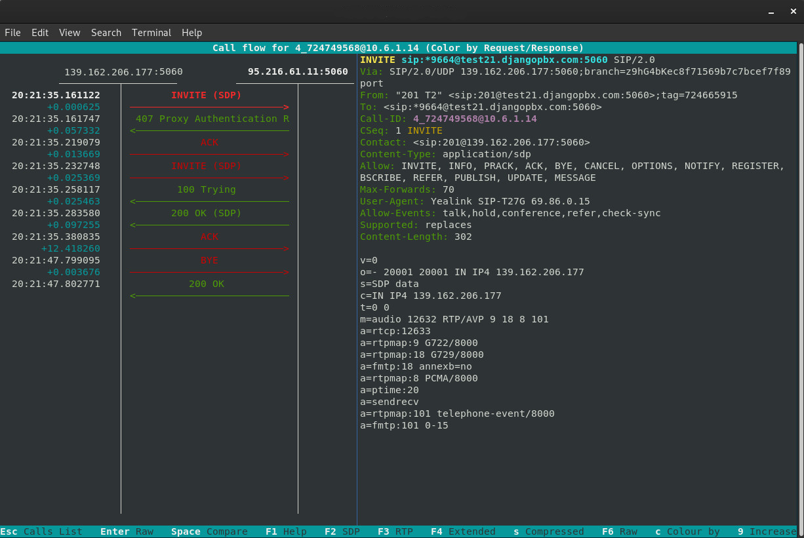

*************************
SIP Diagnostic Commands
*************************

These commands are small shell scripts that have been installed for you in
the :file:`/usr/local/bin` directory.  All of the scripts use sudo to enable
running the various utilities as root.  These scripts can help in diagnosing
problems at the SIP protocol level and also be used for just looking at the
traffic going to and from your DjangoPBX instance.

Commmand line parameters in [] are optional, parameters in <> are mandatory.

A **file ident** togehter with the current date and time helps to form part
of the filename used to create a packet caputure or .pcap file.
If you used "my_customer" as the **file ident** then the resulting .pcap file would be something
like **202312271841-my_customer.pcap**
Packet captures are stored in :file:`/var/log/django-pbx/`

The following commands can all be issued by the django-pbx user at the command prompt:

- **logpcap5060 [file ident]**
    Logs all packets to/from port 5060 to a pcap file.

- **logpcapall [file ident]**
    Logs all packets to/from all SIP ports to a pcap file.

- **logpcapip <host> [file ident]**
    Logs all packets to/from specified host to a pcap file.

- **logpcaprtp <port> <port> [file ident]**
    Logs all packets to/from two specified ports to a pcap file.

- **watch5060**
    Displays on screen all packets to/from port 5060. CTRL-C to end.

- **watchip <ip address>**
    Displays on screen all packets to/from an ip address. CTRL-C to end.

- **watchsipuser <user id>**
    Displays on screen all packets containing a specific user id. CTRL-C to end.

- **watchregisterip <ip address>**
    Displays on screen all REGISTER message exchanges to/from an ip address. CTRL-C to end.

The following three commands are wrappers around `sngrep <https://github.com/irontec/sngrep/wiki>`_

- **watchsipall**
    Runs sngrep as root.

- **watchsipcall**
    Runs sngrep in calls mode. This will only display dialogs starting with INVITE.

- **watchsipuser <user id>**
    Runs sngrep focusing on a specified SIP user.

- **sngrep-pcap**
    Load the last packet capture file into sngrep for viewing.
    On a busy system it is much safer to run one of the **log\*** methods above and
    then view the result in sngrep, rather then simply running sngrep without any command
    line switches.

Typical results (output)
==========================

watch5060
-----------

This is the output from a **watch5060**.  This shows a REGISTRATION message exchange
between a Yealink T27G telephone and an instance of DjangoPBX with the FQDN test21.djangopbx.com.
::

    django-pbx:~/pbx$ watch5060

::

    #
    U 2023/12/27 20:02:54.240623 139.162.206.177:5060 -> 95.216.61.11:5060 #19
    REGISTER sip:test21.djangopbx.com:5060 SIP/2.0.
    Via: SIP/2.0/UDP 139.162.206.177:5060;branch=z9hG4bK724023548;rport.
    From: "201 T2" <sip:201@test21.djangopbx.com:5060>;tag=723906295.
    To: "201 T2" <sip:201@test21.djangopbx.com:5060>.
    Call-ID: 4_723949779@10.6.1.14.
    CSeq: 1 REGISTER.
    Contact: <sip:201@139.162.206.177:5060>.
    Allow: INVITE, INFO, PRACK, ACK, BYE, CANCEL, OPTIONS, NOTIFY, REGISTER, SUBSCRIBE, REFER, PUBLISH, UPDATE, MESSAGE.
    Max-Forwards: 70.
    User-Agent: Yealink SIP-T27G 69.86.0.15.
    Expires: 1800.
    Allow-Events: talk,hold,conference,refer,check-sync.
    Content-Length: 0.
    .

    #
    U 2023/12/27 20:02:54.241223 95.216.61.11:5060 -> 139.162.206.177:5060 #20
    SIP/2.0 401 Unauthorized.
    v:SIP/2.0/UDP 139.162.206.177:5060;branch=z9hG4bK724023548;rport=5060.
    f:"201 T2"<sip:201@test21.djangopbx.com:5060>;tag=723906295.
    t:"201 T2"<sip:201@test21.djangopbx.com:5060>;tag=N37Nt6r4rH1rg.
    i:4_723949779@10.6.1.14.
    CSeq:1 REGISTER.
    User-Agent:DCM.
    Allow:INVITE,ACK,BYE,CANCEL,OPTIONS,MESSAGE,INFO,UPDATE,REGISTER,REFER,NOTIFY,PUBLISH,SUBSCRIBE.
    k:timer,path,replaces.
    WWW-Authenticate:Digest realm="test21.djangopbx.com",nonce="ab84b282-99e9-41f2-87bd-e78aff5fdf07",algorithm=MD5,qop="auth".
    l:0.
    .

    #
    U 2023/12/27 20:02:54.311792 139.162.206.177:5060 -> 95.216.61.11:5060 #21
    REGISTER sip:test21.djangopbx.com:5060 SIP/2.0.
    Via: SIP/2.0/UDP 139.162.206.177:5060;branch=z9hG4bK724057443;rport.
    From: "201 T2" <sip:201@test21.djangopbx.com:5060>;tag=723906295.
    To: "201 T2" <sip:201@test21.djangopbx.com:5060>.
    Call-ID: 4_723949779@10.6.1.14.
    CSeq: 2 REGISTER.
    Contact: <sip:201@139.162.206.177:5060>.
    Authorization: Digest username="201", realm="test21.djangopbx.com", nonce="ab84b282-99e9-41f2-87bd-e78aff5fdf07", uri="sip:test21.djangopbx.com:5060", response="da7aa1369e6df8128ac5263909e0f9be", algorithm=MD5, cnonce="724116085", qop=auth, nc=00000001.
    Allow: INVITE, INFO, PRACK, ACK, BYE, CANCEL, OPTIONS, NOTIFY, REGISTER, SUBSCRIBE, REFER, PUBLISH, UPDATE, MESSAGE.
    Max-Forwards: 70.
    User-Agent: Yealink SIP-T27G 69.86.0.15.
    Expires: 1800.
    Allow-Events: talk,hold,conference,refer,check-sync.
    Content-Length: 0.
    .

    #
    U 2023/12/27 20:02:54.312828 95.216.61.11:5060 -> 139.162.206.177:5060 #22
    SIP/2.0 200 OK.
    v:SIP/2.0/UDP 139.162.206.177:5060;branch=z9hG4bK724057443;rport=5060.
    f:"201 T2"<sip:201@test21.djangopbx.com:5060>;tag=723906295.
    t:"201 T2"<sip:201@test21.djangopbx.com:5060>;tag=pc1ev197NtQBc.
    i:4_723949779@10.6.1.14.
    CSeq:2 REGISTER.
    m:<sip:201@139.162.206.177:5060>;expires=1800.
    Date:Wed, 27 Dec 2023 20:02:55 GMT.
    User-Agent:DCM.
    Allow:INVITE,ACK,BYE,CANCEL,OPTIONS,MESSAGE,INFO,UPDATE,REGISTER,REFER,NOTIFY,PUBLISH,SUBSCRIBE.
    k:timer,path,replaces.
    l:0.
    .

sngrep
--------

This screenshot shows a typical call (INVITE through to BYE) viewed in an sngrep session:

