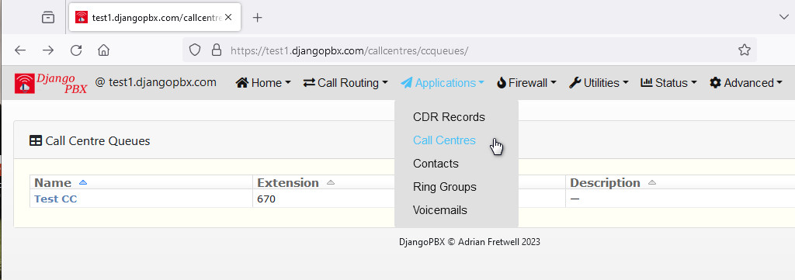
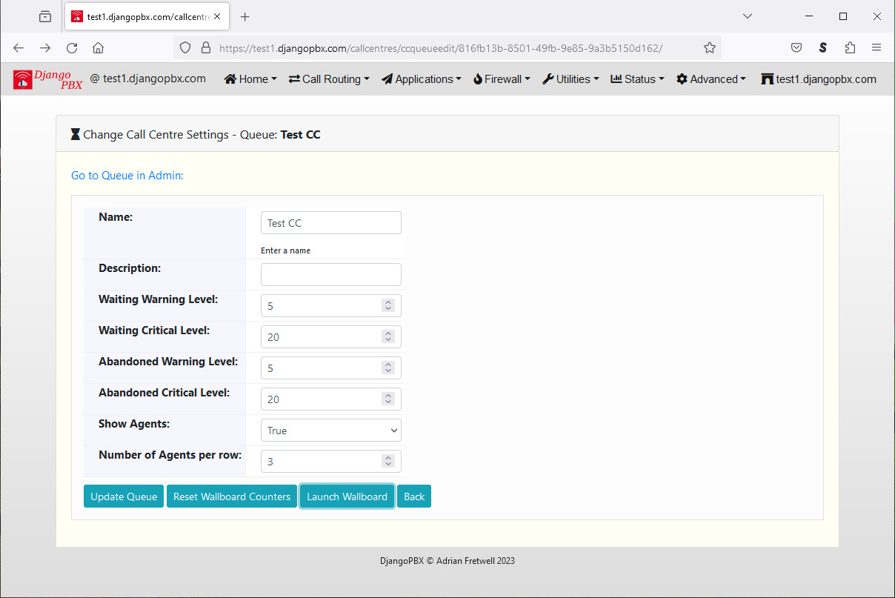

Call Centre Queues
--------------------

An ordinary user with appropriate Call Centre permissions has access to a restricted subset of these settings.
The queues are accessed via the Call Centres application

* Click on the Queue Name to edit the Queue settings or launch the Queue Wallboard

Queue Settings View
^^^^^^^^^^^^^^^^^^^^^

The settings available here control how the Queue will display on the Wallboard.

* **Name:** The name of the Queue, this is displayed next to the clock on the Wallboard.
* **Description:** This is just for notes about the Queue and is not displayed on the Wallboard.
* **Waiting Warning Level:** The number of calls waiting before the waiting card turns from green to amber.
* **Waiting Critical Level:** The number of calls waiting before the waiting card turns from amber to red.
* **Abandoned Warning Level:** The number of calls lost before the abandoned card turns from green to amber.
* **Abandoned Critical Level:** The number of calls lost before the abandoned card turns from amber to red.
* **Show Agents:** Set to True to show the Agents on the Wallboard
* **Number of Agents per row:** How many Agents to show per row.

All the Wallboard colours are controllable via the pbx.css stylesheet.

The **Buttons** allow you to simply **Update** the settings, **Reset** the counters to zero, or **Launch** the Wallboard