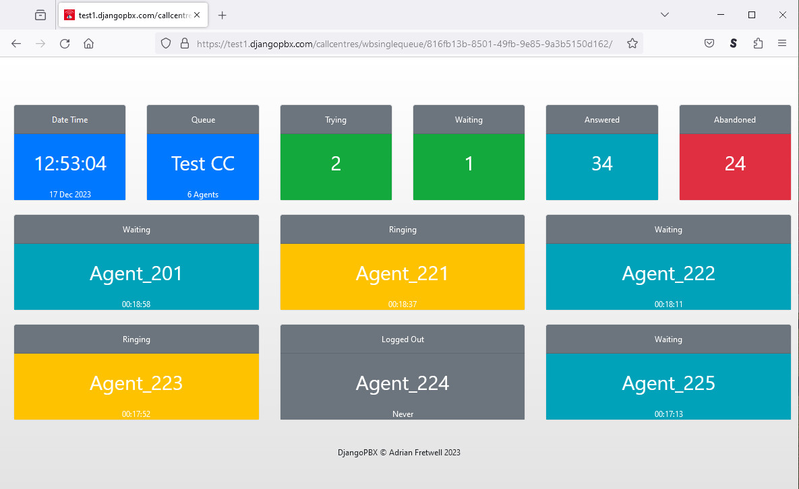

Wallboard
===========

This is a typical **Wallboard** display.

About the Wallboard
--------------------

The display consists of a top row of six cards.  This row is followed by rows of
Agent cards if the Queue is configured to show the Agents in the Wallboard.

The Queue
^^^^^^^^^^^

From left to right, the top row of cards shows a clock with the date, the Queue name
with a count of its agents, then Trying, Waiting, Answered and Abandoned.

* **Trying** is the number of Agents bing called.
* **Waiting** is the number of calls waiting to be answered by an Agent.
* **Answered** is a count of how many calls that have been sucessfully answered by Agents.
* **Abandoned** is a count of the number of calls that have ended without being answered.

Both the *Waiting* and the *Ababndoned* cards will change colour dependent on the
threshold levels set.  By default OK is Green, Warning is Amber, and Critical is Red.

The Agents
^^^^^^^^^^^^

The Agent card header displays the Agents status, the card body colour also reflects
the Agent's status.  The status can be one of:

* **Logged Out:** Grey
* **On Break:** Grey
* **Waiting:** Teal
* **Ringing:** Amber
* **Answered:** Green

The numbers at the very bottom of the Agent card is the number of hours, minutes an seconds
since the status last changed.  An Agent who is yet to log in for the first time will display
"Never" on this line.

