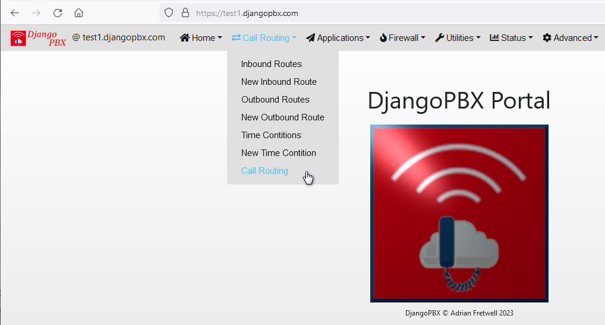

Call Routing
==============

The **Call Routing** menu is primarily aimed at the super user to allow the configuration
of dialplans (:doc:`/admin/dialplan_manager/dialplan_manager`) that are not easily created or editied with in the :doc:`/admin/admin`.

The **Call Routing** menu does contain one non super user item **Call Routing**, this allows end users to update
various diverts and Follow Me settings.

**Outbound Routes** and **Inbound Routes** simply provide links to these dialplans in the :doc:`/admin/admin`.
The other menu items provide links to specific edit tools for those operations.

.. toctree::
  :maxdepth: 3
  :glob:

  new_inbound_route.rst
  new_outbound_route.rst
  time_conditions.rst
  new_time_condition.rst
  extension_call_routing.rst
