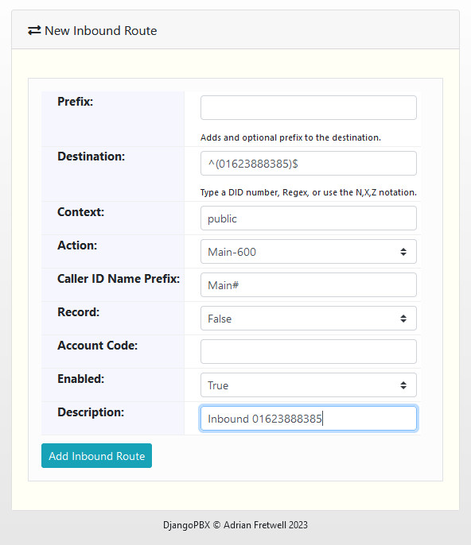

New Inbound Route
==================

This creates a new **Inbound Route** dialplan record.
An **Inbound Route** takes inbound calls from the public context, assigns them to the
destination number's domain context and then routes the call to an internal destination
within that domain.

The screenshot below shows the **Action** select drop-down in more detail:

Options
---------

- **Prefix**: Adds an optional prefix to the destination.
- **Destination**: The Number (DID) called from the Public Switched Telephone Network (PSTN).
- **Context**: Context of the Inbound Route. Usually will be public.
- **Action**: What we should do with the call.
- **Caller ID Name Prefix**:  A short prefix that can be added to the inbound caller ID.  This can help identify on which line the call came in.
- **Record**: Specifies if calls from this route should be recorded.
- **Account Code**: Can be used as a tag for billing purposes.
- **Enabled**: If the Inbound Route is enabled or disabled.
- **Description**: A way to describe what the Inbound route is used for.

Inbound Route Dialplan Entry Created
------------------------------------

The screenshot below shows the dialplan record created from the details entered in the edit screenshot above:

Example XML
-------------

Below is the dialplan XML that was generated from the details entered in the edit screenshot above:

::

    <extension name="01623888385" continue="false" uuid="049421dd-46d8-48c1-9293-f60bcb3c6c5d">
      <condition field="destination_number" expression="^(01623888385)$">
        <action application="export" data="call_direction=inbound" inline="true"/>
        <action application="set" data="domain_uuid=f935eaa5-645d-4fbb-a4a0-1474c0563165" inline="true"/>
        <action application="set" data="domain_name=test1.djangopbx.com" inline="true"/>
        <action application="set" data="hangup_after_bridge=true"/>
        <action application="set" data="continue_on_fail=true"/>
        <action application="set" data="effective_caller_id_name=Main#${caller_id_name}"/>
        <action application="transfer" data="600 XML test1.djangopbx.com"/>
      </condition>
    </extension>

