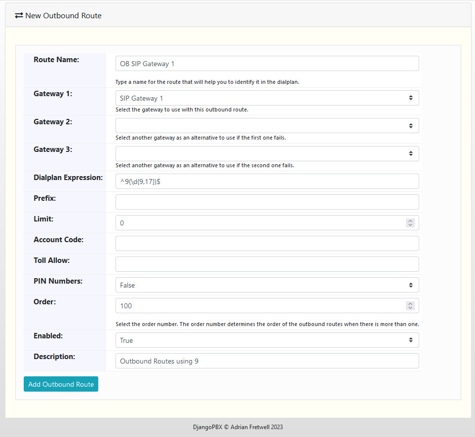
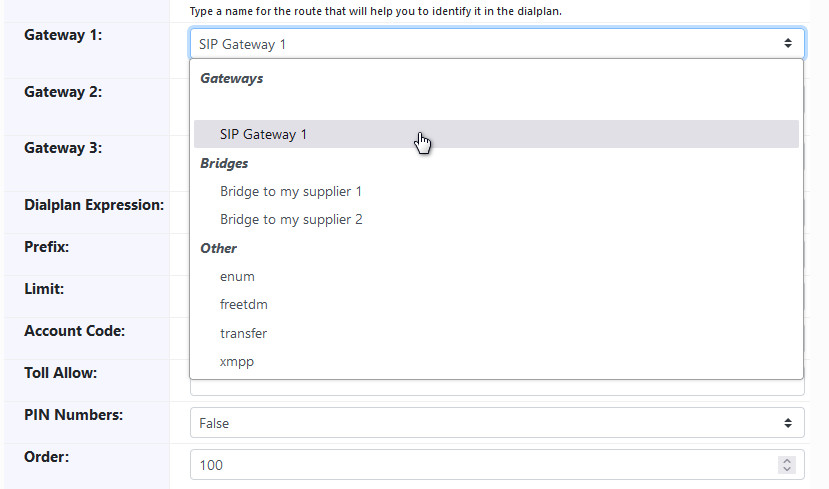
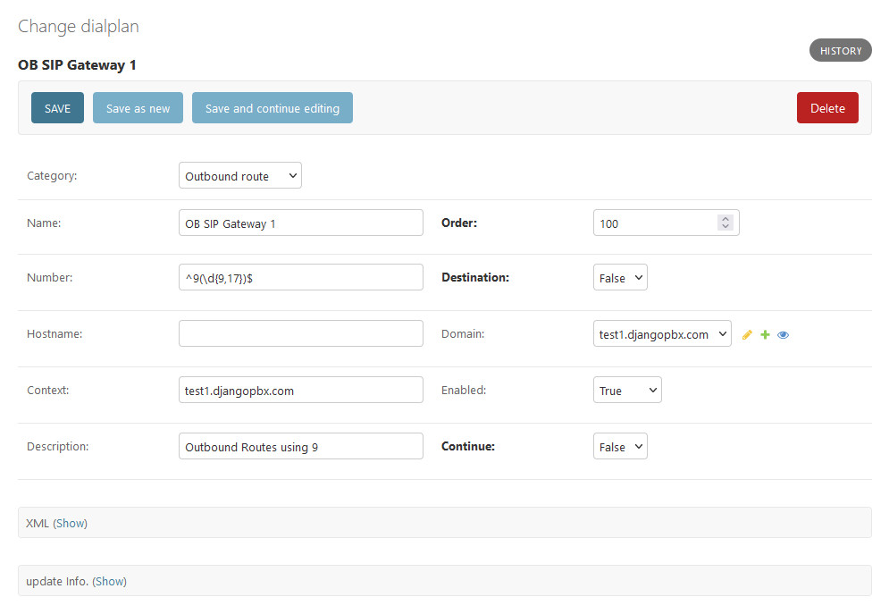

New Outbound Route
===================

This creates a new **Outbound Route** dialplan record.
An **Outbound Route** routes calls to your :doc:`/admin/accounts/gateways`, :doc:`/admin/accounts/bridges` etc..

The screenshot below shows the **Gateway** select drop-down in more detail:

Options
---------

- **Route Name**: A name for this Outbound Route.
- **Gateway 1**: The first gateway to try.
- **Gateway 2**: An alternative gateway to try if Gateway 1 fails.
- **Gateway 3**: A third Gateway to try if Gateway 2 fails.
- **Dialplan Expression**: This is often a regular expression that matches digits dialled when an exteral route is required.
- **Prefix**: A prefix for the Dialplan Expression.
- **Limit**: Set the maximum number of simultaneous call allowed.
- **Account Code**: Can be used as a tag for billing purposes.
- **Toll Allow**: Represents a string of characters set in the **${toll_allow}** channel variable, used to control access to this route.
- **PIN Numbers**: Specified if PIN Numbers are used to control access to this route.
- **Enabled**: If the Outbound Route is enabled or disabled.
- **Description**: A way to describe what the Outbound Route is used for.

Outbound Route Dialplan Entry Created
---------------------------------------

The screenshot below shows the dialplan record created from the details entered in the edit screenshot above:

Example XML
-------------

Below is the dialplan XML that was generated by the details entered in the edit screenshot above:

::

    <extension name="OB SIP Gateway 1" continue="false" uuid="a6a99859-e024-465f-88fa-b1829ae9efb4">
      <condition field="${user_exists}" expression="false"/>
      <condition field="destination_number" expression="^9(\d{9,17})$">
        <action application="export" data="call_direction=outbound" inline="true"/>
        <action application="unset" data="call_timeout"/>
        <action application="set" data="sip_h_X-accountcode=%{accountcode}"/>
        <action application="set" data="hangup_after_bridge=true"/>
        <action application="set" data="effective_caller_id_name=${outbound_caller_id_name}"/>
        <action application="set" data="effective_caller_id_number=${outbound_caller_id_number}"/>    
        <action application="set" data="inherit_codec=true"/>
        <action application="set" data="ignore_display_updates=true"/>
        <action application="set" data="callee_id_number=$1"/>
        <action application="set" data="continue_on_fail=true"/>
        <action application="sleep" data="${sleep}"/>
        <action application="bridge" data="sofia/gateway/b2207659-af6c-46f3-9269-c9dc98b88866/$1"/>
      </condition>
    </extension>

