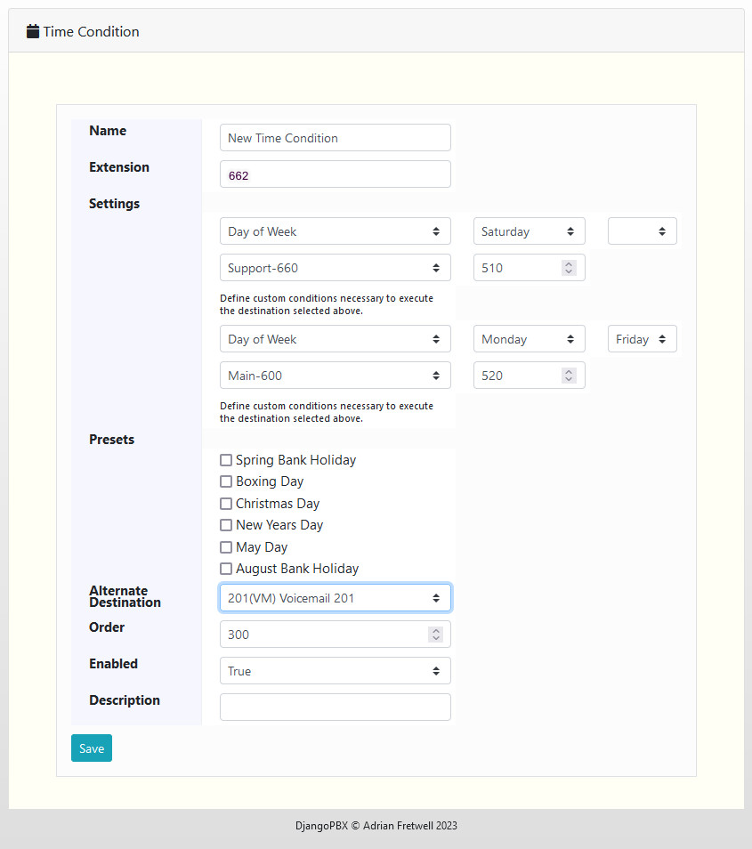
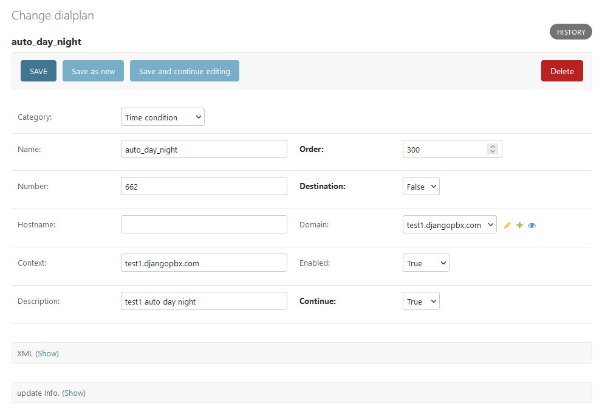

New Time Condition
====================

This creates a new **Time Condition** dialplan record.
A **Time Condition** will allow the system to dynamically route calls bases on the
time of day and/or the day of the week and/or the day of the month/year.
Time conditions can also use preset values definded in the **Default Settings** to
match a specific date and time like **New years Day**

Options
'''''''''

- **Name**: A name for the time condition.
- **Extension**: The Dialplan Number to be used for thsi Time Condition (it must not already exist).
- **Settings**: An expandable section for date and time parameters and their associated destinations.
- **Presets**: Various pre-defined conditions.
- **Alternate Destination**: Destination to route the call if non of the conditions in the settings section match.
- **Order**: Specifies the order in which this Time Condition is evaluated.
- **Enabled**: If the Time Condition is enabled or disabled.
- **Description**: A way to describe what the Time Condition is used for.

Time Condition Dialplan Entry Created
''''''''''''''''''''''''''''''''''''''

The screenshot below shows a dialplan record created from details entered similar to the edit screenshot above:

Example XML
'''''''''''''

Below is the dialplan XML that was generated from a typical Time Condition:

::

    <extension name="auto_day_night" continue="true" uuid="616194bd-ec75-46d3-b777-473108c9b86b">
        <condition field="destination_number" expression="^662$"/>
        <condition wday="2-5" minute-of-day="510-1020" break="never">
            <action application="transfer" data="600 XML test1.djangopbx.com"/>
        </condition>
        <condition field="destination_number" expression="^662$"/>
        <condition wday="6-6" minute-of-day="510-990" break="never">
            <action application="bridge" data="sofia/profile/internal/$1@supplier1.com"/>
        </condition>
        <condition field="destination_number" expression="^662$"/>
        <condition mday="26" mon="12" break="never">
            <action application="set" data="preset=boxing_day"/>
            <action application="transfer" data="*99201 XML test1.djangopbx.com"/>
        </condition>
        <condition field="destination_number" expression="^662$"/>
        <condition mday="25" mon="12" break="never">
            <action application="set" data="preset=christmas_day"/>
            <action application="transfer" data="*99201 XML test1.djangopbx.com"/>
        </condition>
        <condition field="destination_number" expression="^662$"/>
        <condition mday="1" mon="1" break="never">
            <action application="set" data="preset=new_years_day"/>
            <action application="transfer" data="*99201 XML test1.djangopbx.com"/>
        </condition>
        <condition field="destination_number" expression="^662$">
            <action application="transfer" data="*99201 XML test1.djangopbx.com"/>
        </condition>
    </extension>

