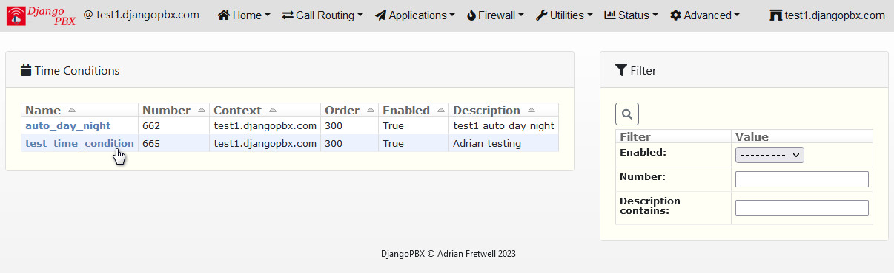

Time Conditions
=================

A **Time Condition** will allow the system to dynamically route calls based on the
time of day and/or the day of the week and/or the day of the month/year.
**Time Conditions** can also use preset values definded in the **Default Settings** to
match a specific date and time like **New Year's Day**

The screenshot below shows a list of **Time Conditions** that are available within the domain.

